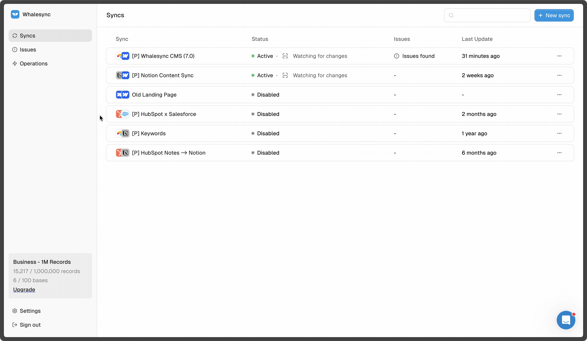

# What is Whalesync?

### Welcome! We're so glad you're here. 💙

Whalesync is a no-code integration tool that **connects your SaaS apps with your favorite spreadsheet**.

Without any code, you can start controlling your business tools from flexible, easy-to-use spreadsheets like Airtable, Notion, and Google Sheets.

<figure><figcaption></figcaption></figure>

When your apps are deeply connected to spreadsheets you gain work super powers like the ability to:

* Bulk edit records
* Let anyone on the team make updates without training
* Utilize formulas and AI

These super powers enable powerful use cases like:

* Generate thousands of programmatic SEO pages (Webflow + Airtable)
* Track your sales deals in Notion (HubSpot + Notion)
* Build internal tools (Postgres + Airtable)
* Let investors update deals from a sheet (Affinity + Sheets)

## Whalesync is different from tools like Zapier

Our goal is very specific: create a two-way sync between your spreadsheet and your app.

Workflow automation tools like Zapier solve a different problem: on a trigger, run a series of automations.

For more details on the breakdown, check out: [How is Whalesync different from Zapier?](https://www.whalesync.com/blog/how-is-whalesync-different-from-zapier)

<figure><figcaption></figcaption></figure>

## Quick Start Tips

### 🚀 Getting Started Right
1. **Start small**: Test with 10-20 records before syncing your entire dataset
2. **Map carefully**: Only sync the fields you actually need
3. **Choose sync direction thoughtfully**: Not every field needs two-way sync
4. **Use filters**: Sync only the records that matter to your workflow

### ⚠️ Avoid Common Pitfalls
- **Don't sync everything**: More fields = more complexity and potential issues
- **Test destructive actions**: Always test delete behavior with sample data
- **Check field compatibility**: Make sure field types can sync properly  
- **Monitor initially**: Watch the Operations page closely during your first few days

### 🛡️ Data Safety Best Practices
- **Enable delete protection**: Prevent accidental data loss
- **Backup critical data**: Keep backups of important datasets
- **Use staging environments**: Test major changes in a safe environment first
- **Document your setup**: Keep notes on field mappings and business logic

## Popular Connector Combinations

Here are some of the most popular two-way sync combinations our users love:

| Spreadsheet/Database | Business App | Use Case |
| --- | --- | --- |
| 📊 Airtable | 🌐 Webflow | Generate programmatic SEO pages |
| 📝 Notion | 📈 HubSpot | Track sales deals and CRM data |
| 🗄️ Postgres/Supabase | 📊 Airtable | Build internal tools and dashboards |
| 📋 Google Sheets | 🤝 Affinity | Let investors update deal information |
| 📊 Airtable | 🛍️ Shopify | Manage product catalogs |
| 📝 Notion | 📧 Memberstack | User management and content access |


All combinations support two-way sync, meaning changes in either app automatically update the other.


## The best way to discover Whalesync is to try it


[quick-start.md](start-here/quick-start.md)

