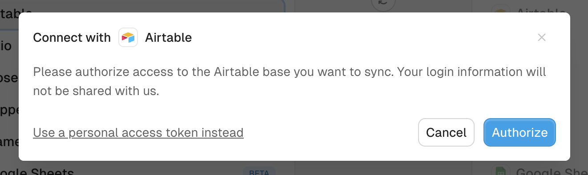

# Connect Airtable with a personal access token

Signing in to Airtable is the default way to connect it to Whalesync. A personal access token is an alternative if you run many syncs, prefer not to sign in, or are setting up a sync through the [API](../../api/reference.md) or [MCP server](../../api/mcp/README.md) and need a credential to hand over.

A token differs from signing in in four ways:

* Airtable limits how many times one account can authorize Whalesync by signing in. Each sync uses one authorization, so accounts with many syncs hit the limit. A token can back any number of syncs.
* It does not expire.
* It reaches only the bases you add to it in Airtable.
* It can be pasted into the API or given to an agent. A sign-in has to happen in a browser.

## Create the token

1. Go to [airtable.com/create/tokens](https://airtable.com/create/tokens) and click **Create new token**.
2. Name it `Whalesync`.
3. Add every scope listed below.
4. Under **Access**, add every base you will sync, or the whole workspace.
5. Click **Create token** and copy it. Airtable shows it only once.

### Scopes

All seven scopes are required.

| Scope | Why Whalesync needs it |
| --- | --- |
| `data.records:read` | Read records from your tables. |
| `data.records:write` | Create, update, and delete records during sync. |
| `data.recordComments:read` | Read record comments. |
| `data.recordComments:write` | Write record comments. |
| `schema.bases:read` | Read the tables and fields in your bases. |
| `schema.bases:write` | Create tables and fields in Airtable when you ask for them. |
| `webhook:manage` | Register webhooks so changes in Airtable sync right away. |

### Access

A base left off the token does not appear in Whalesync's base picker. Reauthorizing with a token that misses a base the connection already syncs is refused.

If you expect to add bases later, give the token access to the whole workspace.

## Paste the token into Whalesync

1. In the connect step, choose **Use a personal access token instead**.

<figure><figcaption></figcaption></figure>

2. Paste the token and click **Authorize**.
3. Pick the base to sync.

A connection keeps its method. To switch between token and sign-in, create a new connection.

## Errors

| Message | What to do |
| --- | --- |
| Airtable did not accept this personal access token | The token was copied wrong or revoked. Copy it again, or create a new one. |
| This token is missing a scope Whalesync needs | Create a new token with all seven scopes above. Scopes can't be added to an existing token. |
| This token does not have access to a base this connection syncs (base app…) | The message ends with the id of the missing base. In Airtable, edit the token and add that base under **Access**. |

## Revoking the token

Deleting the token in Airtable stops every sync using it until you [reconnect](../../resources/support/reconnecting-a-sync.md) with a new token.
