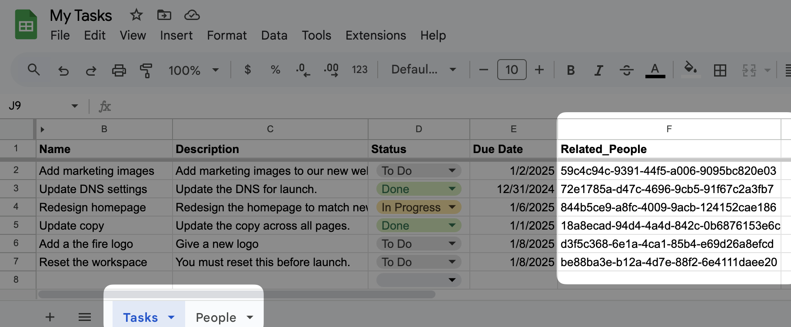
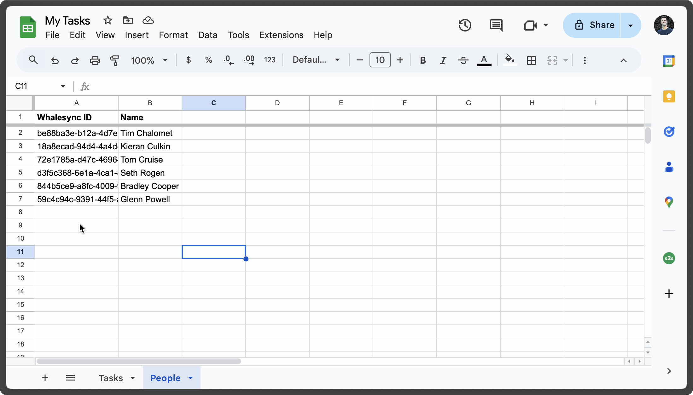

# Foreign keys

Foreign keys allow you to create relationships between tables in your synced Google Sheets.&#x20;

<figure><figcaption>
An example of a foreign key field relating People to Tasks
</figcaption></figure>

### How to set up foreign keys

#### 1. Define a foreign key column

Create a column in the following format: `Related_[Table Name]`

<figure><figcaption>
Here our column name is "Related_People" because we're relating Tasks to the People table
</figcaption></figure>


Capitalization matters, so make sure the table name matches exactly.&#x20;


#### 2. Map the Foreign Key field in Whalesync&#x20;

<figure><figcaption></figcaption></figure>

Google Sheets foreign key fields map with [reference fields](../../features/additional-features/reference-fields.md) in other apps.


You will likely need to click "Referesh" to ensure Whalesync sees your newest fields


#### 3. Insert Foreign Key values

To link a row from another table to your Foreign Key column:&#x20;

1. Copy the Whalesync ID of the row you want to reference.
2. Paste the Whalesync ID into the foreign key column.

<figure><figcaption>
Copying the Whalesync ID from a person in the People's table into the "Related_People" column in Tasks
</figcaption></figure>

* The Whalesync ID is a unique identifier for each row.
* It is Column A in each mapped table in Google Sheets, and it is hidden.
* Click on the arrow to unhide the Whalesync ID column.


**Avoid making any changes to the Whalesync ID column to avoid sync issues.**&#x20;

