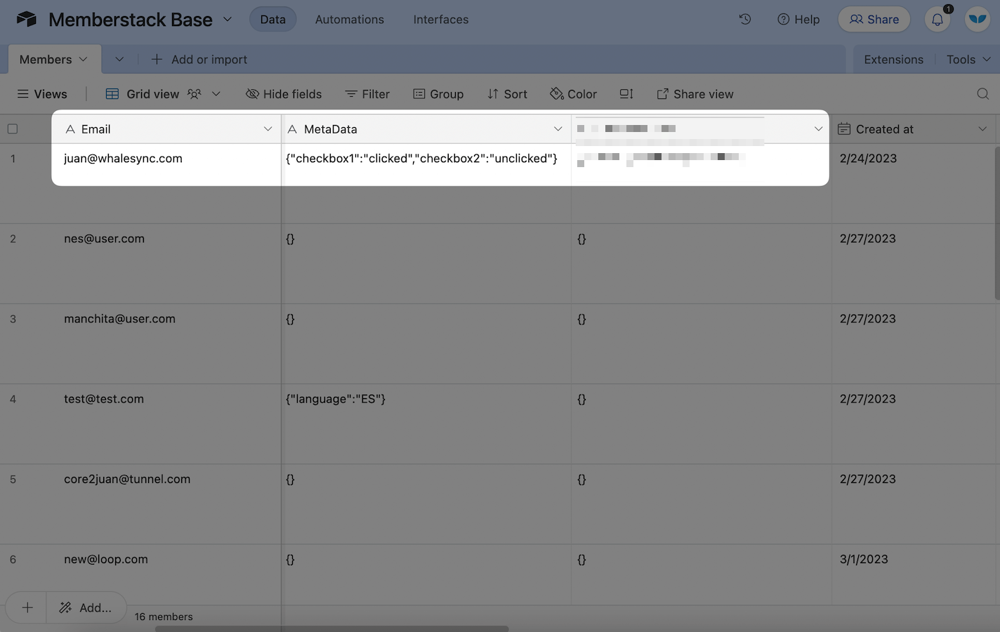

# Memberstack

## Supported Fields

<table><thead><tr><th>Field</th><th>Status<select><option value="6c90dea3d4b34f409e73be79b7076c4a" label="✖️ Not Yet" color="blue"></option><option value="9e01356060cc4ea4988d69f72fe19d39" label="✅ Supported" color="blue"></option><option value="bd4357bee12749d0b80f7bc4a94ec3b5" label="➡️ Supported (1-Way)" color="blue"></option><option value="9b0955a85d044258a10aa0d1d3695a79" label="✅ Supported (as JSON)" color="blue"></option></select></th><th data-hidden></th></tr></thead><tbody><tr><td>✉️ Email</td><td>✅ Supported</td><td></td></tr><tr><td>📝 Login redirect</td><td>✅ Supported</td><td></td></tr><tr><td>☑️ Permissions</td><td>✅ Supported</td><td></td></tr><tr><td>🆔 Plan IDs</td><td>✅ Supported</td><td></td></tr><tr><td>🗃️ Custom fields</td><td>✅ Supported</td><td></td></tr><tr><td>🗃️ Metadata</td><td>✅ Supported (as JSON)</td><td></td></tr><tr><td>🆔 Memberstack record ID</td><td>➡️ Supported (1-Way)</td><td></td></tr><tr><td>🕠 Created at</td><td>➡️ Supported (1-Way)</td><td></td></tr><tr><td>🕠 Last login</td><td>➡️ Supported (1-Way)</td><td></td></tr><tr><td>🗃️ Plans Data</td><td>➡️ Supported (1-Way)</td><td></td></tr><tr><td>☑️ Verified</td><td>➡️ Supported (1-Way)</td><td></td></tr><tr><td>󠁻󠁻🗃️ JSON</td><td>✅ Supported (as JSON)</td><td></td></tr></tbody></table>

## Things to Keep in Mind 

### Auto-generated passwords


**Creating a new user via sync, will auto-generate a password in Memberstack**


Whalesync allows you to create new Memberstack members from a synced app. For example, you can create a new member from Airtable :tada:.

When creating a new member in Airtable, Whalesync auto-generates a password for that Member. That new member will need to reset their password to log in.

### Syncing custom fields


**To sync custom fields, you will need to create a member in Memberstack with the email "schema@whalesync.com" with values in custom fields.**


See :point\_down:for more details


[memberstack-custom-fields.md](memberstack-custom-fields.md)


### Default sync delay


**If syncing Memberstack and Airtable, we default to a 10-second sync delay from Airtable to Memberstack**


See :point\_down:for more details


[creating-users-via-whalesync.md](../../features/additional-features/creating-users-via-whalesync.md)


### Metadata fields


**Metadata fields sync as JSON**


We support 2-way syncing of Memberstack Metadata fields as JSON blobs. You can edit the data in those fields as long as they retain the correct JSON format.

<figure><figcaption></figcaption></figure>

## Templates 

Copy our Airtable or Notion templates to instantly have a table set up to sync with Memberstack.


