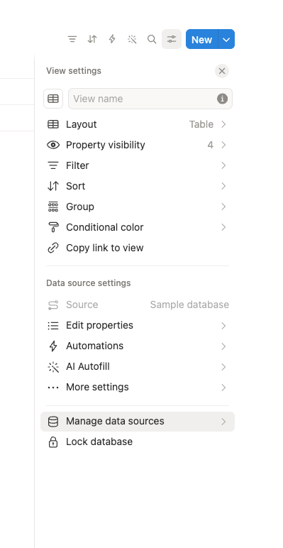
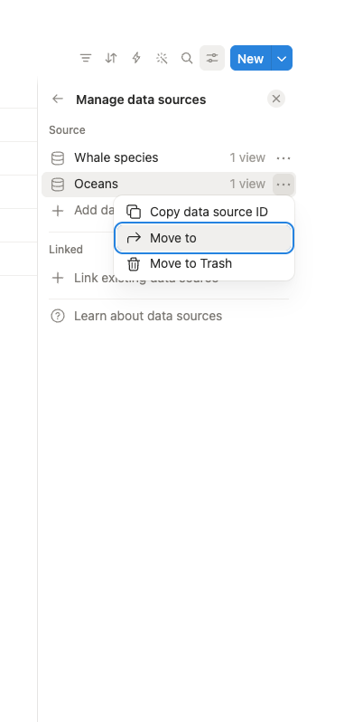

# Multiple data sources

### `Databases with multiple data sources are not supported in this API version.`

On September 3, 2025, Notion updated their API to allow [multiple data sources](https://www.notion.com/help/data-sources-and-linked-databases) per database. A data source is a set of pages in a database — so a single database can now contain several independent collections of pages.

Whalesync fully supports multiple data sources on all **newly created** syncs. However, this change is **not backward-compatible** with syncs that were created before the update.

If you're seeing the error above, you have two options:

### Option 1: Create a new sync

Create a new sync in Whalesync. New syncs use the latest Notion API version and support multiple data sources out of the box.

### Option 2: Remove extra data sources in Notion

If you'd prefer to keep your existing sync, you can remove any additional data sources from the Notion database so that it only contains a single data source.

To do this, open the database's view settings and click **Manage data sources**:

<figure><figcaption>
Open view settings, then click "Manage data sources"
</figcaption></figure>

Then click the **•••** menu next to the extra data source and choose **Move to** or **Move to Trash**:

<figure><figcaption>
Use the ••• menu to move or delete extra data sources
</figcaption></figure>


Once a database has only one data source, the existing sync will work as before.

