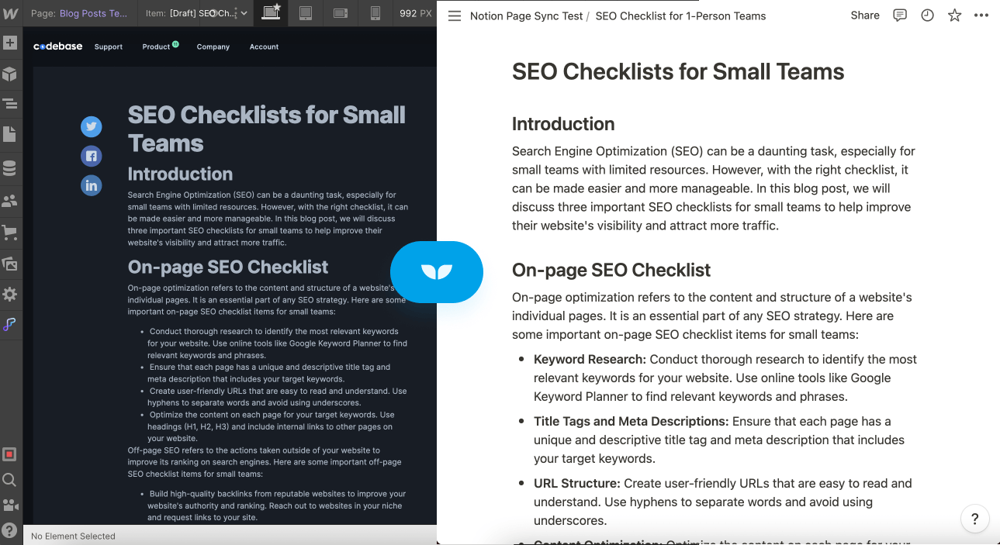
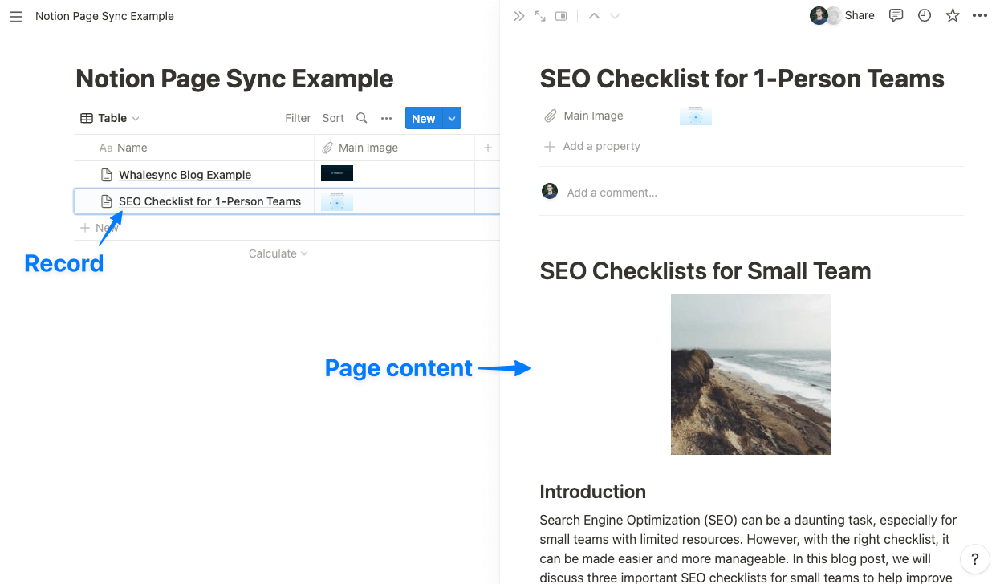

# Notion page sync

<figure><figcaption></figcaption></figure>

### About Notion page sync

Notion Page Sync is one of Whalesync's most powerful Notion features. As you might have guessed, it allows you to sync data from Notion pages to rich text fields in other apps :exploding\_head:.

This enables you to write entire blog posts in Notion and sync them instantly to your live blog or site. You can even use Notion AI to write these posts for you.

### Notion page content vs. Notion records

A Notion database has a list of records. If you open one of those records, it opens up a page. That page is what Whalesync considers "Notion page content":

<figure><figcaption></figcaption></figure>

### How to set up Notion page sync

To use Notion page sync, simply map the "Page Content" field on the field mapping page. This typically maps to a rich text field in other apps like Webflow.

<figure><figcaption></figcaption></figure>

### Things to keep in mind


Notion page sync pairs really well with our [Webflow Status field extension](../webflow/webflow-status-field.md) feature if syncing Notion -> Webflow



**Notion page content is a "read-only" field** meaning it can only be synced 1-way



If syncing Notion pages to the Webflow CMS, **some content may not appear in the Webflow CMS but WILL appear on your live site**. Webflow's CMS doesn't always interpret HTML properly, but web pages will.


<figure><figcaption></figcaption></figure>

### Supported blocks

If there are blocks or media formats that you need but do not see listed below, please reach out to support@whalesync.com. We are always looking for ways to improve the product!

<table><thead><tr><th>Block</th><th>Status<select><option value="b22bf9be887443049ab27a662e9d8a0c" label="✅ Supported" color="blue"></option><option value="d0b30e9802464ef68f948996577c67df" label="✖️ Not Supported" color="blue"></option><option value="297590c1d191421ba907116eb63e2899" label="✅ Supported - Embedded Images Only" color="blue"></option><option value="0669e7eb92b64963b8cee1ec2a0dd743" label="✅ Supported - Embedded Content Only" color="blue"></option></select></th></tr></thead><tbody><tr><td> 📝 Paragraph</td><td>✅ Supported</td></tr><tr><td>💪 Headings (h1-h3)</td><td>✅ Supported</td></tr><tr><td>🖼️ Images (png, jpg, gif, svg, unsplash)</td><td>✅ Supported</td></tr><tr><td>🔗 Links</td><td>✅ Supported</td></tr><tr><td>📹 Video (mp4, ogg, webm, youtube,  vimeo, wistia)</td><td>✅ Supported</td></tr><tr><td>⚫ Bulleted list</td><td>✅ Supported</td></tr><tr><td>⚪ Sub-bulleted list</td><td>✅ Supported</td></tr><tr><td>1️⃣ Numbered list</td><td>✅ Supported</td></tr><tr><td>🇦Sub-numbered list</td><td>✅ Supported</td></tr><tr><td>🎤 Quote</td><td>✅ Supported</td></tr><tr><td>⌨️ Code inline</td><td>✅ Supported</td></tr><tr><td>⌨️ Code block</td><td>✅ Supported</td></tr><tr><td>🔈Audio (mp3, ogg)</td><td>✅ Supported</td></tr><tr><td>☑️ To-do list</td><td>✅ Supported</td></tr><tr><td>➖ Divider</td><td>✅ Supported</td></tr><tr><td>⬇️ Toggle</td><td>✅ Supported</td></tr><tr><td>🔖 Bookmark</td><td>✅ Supported</td></tr><tr><td>🗣️ Call outs</td><td>✖️ Not Supported</td></tr><tr><td>🔢 Equation</td><td>✖️ Not Supported</td></tr><tr><td>👇 Mention</td><td>✖️ Not Supported</td></tr><tr><td>🔄 Synced blocks</td><td>✖️ Not Supported</td></tr></tbody></table>


**Captions can be used to add alt text to images**

We support the alt property on the image html tag and use the caption text for its value. We use the embed html tag for Unsplash images (because doesn't work otherwise) and the image tag for all other images.


