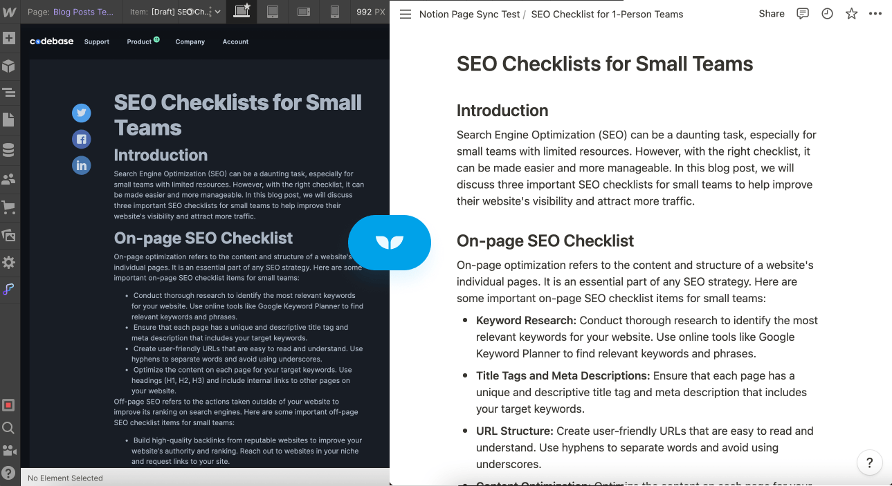
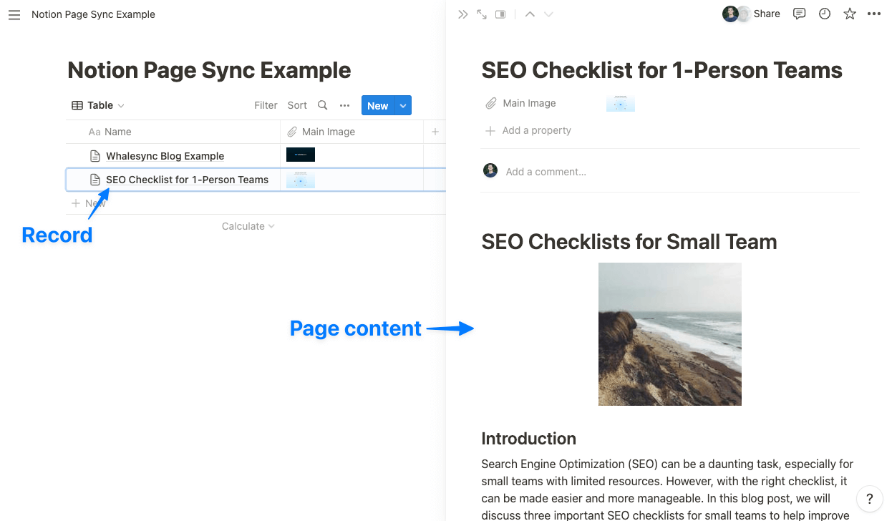

# Notion page sync

<figure><figcaption></figcaption></figure>

### About Notion Page Sync

Notion Page Sync is one of Whalesync's most powerful Notion features. As you might have guessed, it allows you to sync data from Notion pages to rich text fields in other apps!

This enables you to write entire blog posts in Notion and sync them instantly to your live blog or site. You can even use Notion AI to write these posts for you.

### When to use Notion Page Sync

Notion Page Sync works best when Notion is the original source of your content. This is because Whalesync can reliably convert Notion's block-based format into HTML for other apps, and when that content is edited elsewhere, we can preserve and map it back to Notion's structure. However, the reverse isn't true—arbitrary HTML from other sources can't always be converted into Notion's proprietary block format. As a result, you might find that some of your styling or custom HTML is lost when sending updates back to your website.

If you only need content to flow _into_ Notion from another app, try using a one-way sync on just the Page Content column or the whole table.

### Notion page content vs. Notion records

A Notion database has a list of records. If you open one of those records, it opens up a page. That page is what Whalesync considers "Notion page content":

<figure><figcaption></figcaption></figure>

### How to set up Notion page sync

To use Notion page sync, simply map the "Page Content" field on the field mapping page. This typically maps to a rich text field in other apps like Webflow.

<figure><figcaption></figcaption></figure>

### Things to keep in mind


Notion page sync pairs really well with our [Webflow Status field extension](../webflow/webflow-status-field.md) feature if syncing Notion -> Webflow



**Notion page content supports 2-way syncing** meaning you can sync content both from Notion to other apps and from other apps back to Notion



If syncing Notion pages to the Webflow CMS, **some content may not appear in the Webflow CMS but WILL appear on your live site**. Webflow's CMS doesn't always interpret HTML properly, but web pages will.



**Shared OAuth settings**: Notion OAuth has only one set of settings per Notion account, which means all your Whalesync bases will always share the same OAuth permissions. If you have multiple bases and reauthorize one of them (changing which databases you're sharing), it will automatically update the shared databases for all your other bases as well.



**Performance with large databases**: The Notion API is significantly slower than most other APIs that Whalesync integrates with. When syncing page content, Whalesync must make multiple API calls per page to fetch all the blocks and nested content. For databases with thousands of pages, this can result in long sync times. If you're experiencing slow syncs, consider moving the pages you want to sync into a smaller, dedicated Notion database with only the records you need. This reduces the number of API calls per polling round and can dramatically improve sync speed.



**Page content limitations when syncing INTO Notion**:

- **200 block limit**: Each Notion page is limited to 200 blocks when syncing into Notion
- **No style preservation**: Classes and styles are not preserved when syncing into Notion
  

<figure><figcaption></figcaption></figure>

### Supported blocks

If there are blocks or media formats that you need but do not see listed below, please reach out to support@whalesync.com. We are always looking for ways to improve the product!


**How unsupported blocks are handled**: Blocks that are not supported will be ignored during the sync process. These blocks will not be deleted or updated in Notion unless their parent object is deleted. They will simply remain unchanged in your Notion page.


<table><thead><tr><th>Block</th><th>Status<select><option value="b22bf9be887443049ab27a662e9d8a0c" label="✅ Supported" color="blue"></option><option value="d0b30e9802464ef68f948996577c67df" label="✖️ Not Supported" color="blue"></option><option value="297590c1d191421ba907116eb63e2899" label="✅ Supported - Embedded Images Only" color="blue"></option><option value="0669e7eb92b64963b8cee1ec2a0dd743" label="✅ Supported - Embedded Content Only" color="blue"></option></select></th></tr></thead><tbody><tr><td>📝 Paragraph</td><td>✅ Supported</td></tr><tr><td>💪 Headings (h1-h3)</td><td>✅ Supported</td></tr><tr><td>🖼️ Images (png, jpg, gif, svg, unsplash)</td><td>✅ Supported</td></tr><tr><td>🔗 Links</td><td>✅ Supported</td></tr><tr><td>📹 Video (mp4, ogg, webm, youtube, vimeo, wistia)</td><td>✅ Supported</td></tr><tr><td>⚫ Bulleted list</td><td>✅ Supported</td></tr><tr><td>⚪ Sub-bulleted list</td><td>✅ Supported</td></tr><tr><td>1️⃣ Numbered list</td><td>✅ Supported</td></tr><tr><td>🇦Sub-numbered list</td><td>✅ Supported</td></tr><tr><td>🎤 Quote</td><td>✅ Supported</td></tr><tr><td>⌨️ Code inline</td><td>✅ Supported</td></tr><tr><td>⌨️ Code block</td><td>✅ Supported</td></tr><tr><td>🔈Audio (mp3, ogg)</td><td>✅ Supported</td></tr><tr><td>☑️ To-do list</td><td>✅ Supported</td></tr><tr><td>➖ Divider</td><td>✅ Supported</td></tr><tr><td>⬇️ Toggle</td><td>✅ Supported</td></tr><tr><td>🔖 Bookmark</td><td>✅ Supported</td></tr><tr><td>📊 Table</td><td>✅ Supported</td></tr><tr><td>🗣️ Call outs</td><td>✅ Supported</td></tr><tr><td>📐 Column list/Column</td><td>✅ Supported</td></tr><tr><td>🔄 Synced blocks</td><td>✖️ Not Supported</td></tr><tr><td>📋 Template</td><td>✖️ Not Supported</td></tr><tr><td>🍞 Breadcrumb</td><td>✖️ Not Supported</td></tr><tr><td>📑 Table of contents</td><td>✖️ Not Supported</td></tr><tr><td>📄 Child page</td><td>✖️ Not Supported</td></tr><tr><td>🗃️ Child database</td><td>✖️ Not Supported</td></tr><tr><td>🔗 Link to page</td><td>✖️ Not Supported</td></tr><tr><td>🔗 Link preview</td><td>✖️ Not Supported</td></tr><tr><td>🔢 Equation</td><td>✖️ Not Supported</td></tr><tr><td>📎 PDF</td><td>✖️ Not Supported</td></tr><tr><td>📁 File</td><td>✖️ Not Supported</td></tr><tr><td>👇 Mention</td><td>✖️ Not Supported</td></tr></tbody></table>


**Captions can be used to add alt text to images**

We support the alt property on the image html tag and use the caption text for its value. We use the embed html tag for Unsplash images (because doesn't work otherwise) and the image tag for all other images.

