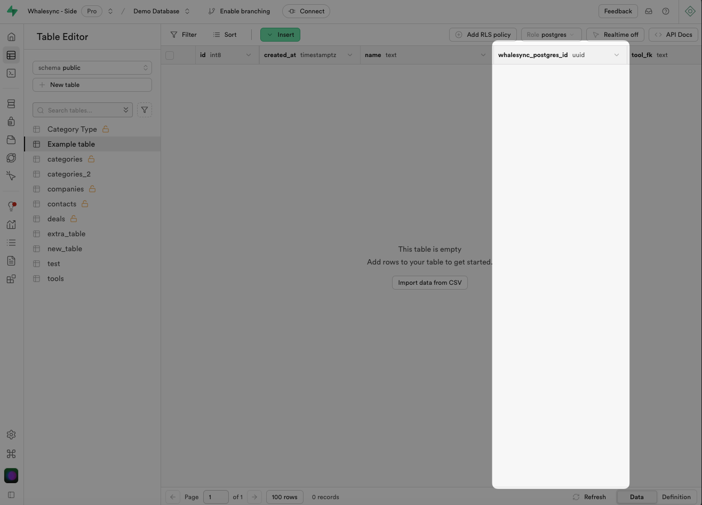

# Why do I need an ID column?

To enable two-way sync between Supabase and your other apps, Whalesync needs a way to uniquely identify each record in your Supabase database.

If your table already has a unique primary key, Whalesync will use it.

If not, Whalesync will automatically add a whalesync\_postgres\_id column to ensure each record can be tracked reliably.

<figure><figcaption>
What the automatically added "whalesync_postgres_id" column looks like in Supabase
</figcaption></figure>

Alternatively, if you'd prefer to add your unique ID field manually, you can follow these steps:


[adding-default-values-to-primary-keys.md](adding-default-values-to-primary-keys.md)


