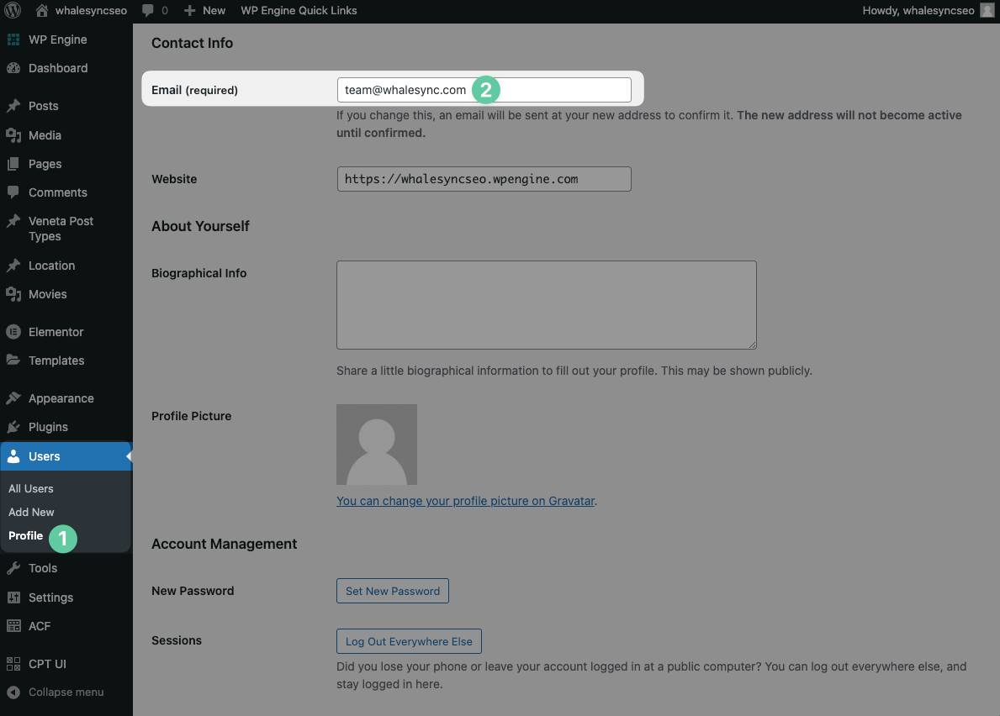
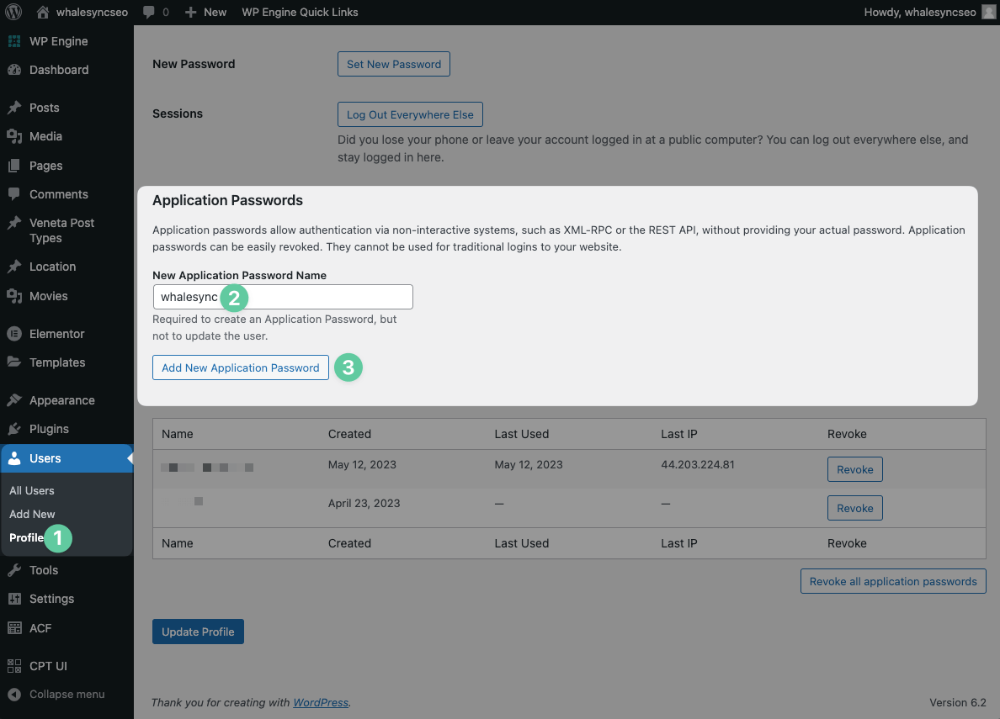

# Authorize WordPress.org

### How to get your user email

1. Click Users > Profile
2. Scroll down to `Email`
3. Copy your email address

<figure><figcaption></figcaption></figure>

### How to get your password

1. Click Users > Profile
2. Scroll down to `Application Passwords`
3. Enter an application password name
4. Press "Add New Application Password"
5. Copy your password

<figure><figcaption></figcaption></figure>

### Which user role do I need?

The user you connect with needs at least the **Editor** role. When you connect, Whalesync checks that the user can edit posts, so an Author, Contributor, or Subscriber account will fail with a "not allowed to edit" error even when the email and application password are correct.

### How to find your domain name

Simply enter the domain of your WordPress site. For example:

<mark style="color:purple;background-color:yellow;">**https://whalesyncseo.wpengine.com**</mark>

Some WordPress hosts don't let Whalesync reach your data through your site's main domain. In that case, enter the domain where your WordPress dashboard lives—but **without** the `/wp-admin` path. For example, if your dashboard is at `https://blog.example.com/wp-admin`, enter `https://blog.example.com` (not your public homepage at `https://example.com`).

### "You are not allowed to edit posts"

This error means your login worked but the user does not have permission to edit content. Two things to check:

1. Give the connecting user at least the **Editor** role.
2. Make sure the WordPress URL you entered is your dashboard site URL. It can differ from your public site URL.
