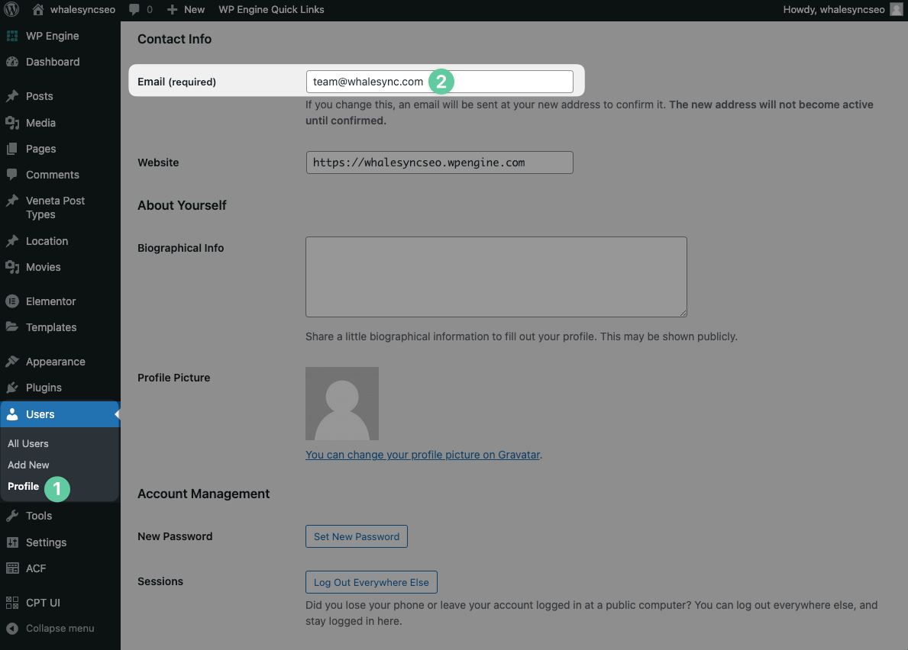

# Authorize WordPress.org

### How to get your user email

1. Click Users > Profile
2. Scroll down to `Email`
3. Copy your email address

<figure><figcaption></figcaption></figure>

### How to get your password

1. Click Users > Profile
2. Scroll down to `Application Passwords`
3. Enter an application password name
4. Press "Add New Application Password"
5. Copy your password

<figure><figcaption></figcaption></figure>

### How to find your domain name

Simply enter the domain of your WordPress site. For example:

<mark style="color:purple;background-color:yellow;">**https://whalesyncseo.wpengine.com**</mark>
