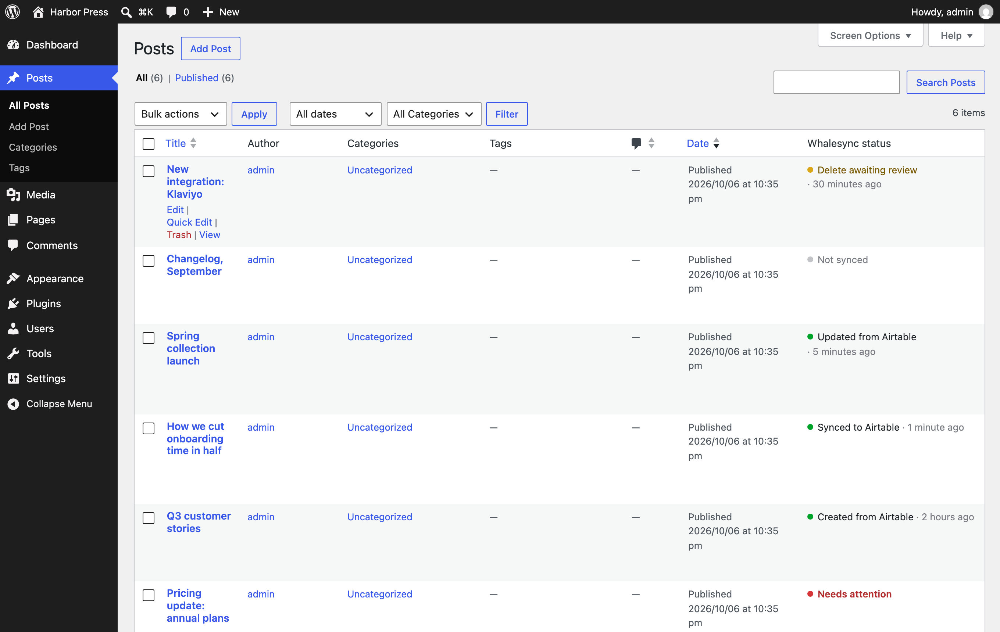
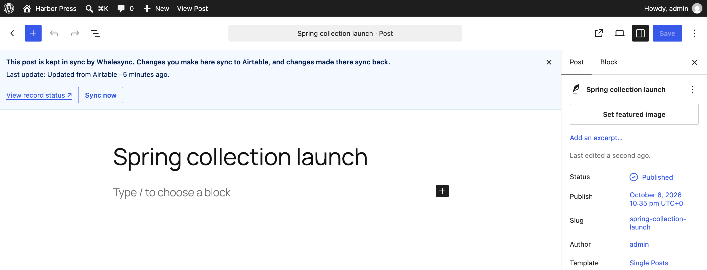
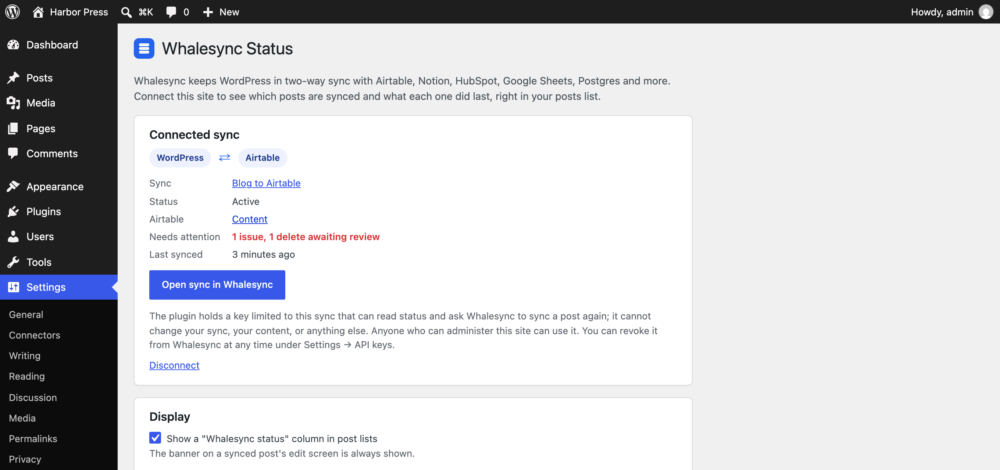

# Whalesync Status plugin

Whalesync Status is a free WordPress plugin that shows what Whalesync is doing with your posts, from inside WordPress. It is optional, your sync runs exactly the same with or without it. 

[Get it from the WordPress.org plugin directory](https://wordpress.org/plugins/whalesync/), or search for "Whalesync Status" under Plugins → Add New in your WordPress admin.

## What it adds

**A "Whalesync status" column in your post lists.** Every post type in your sync gets a new column with the last sync event, like "Updated from Airtable · 5 minutes ago" or "Synced to Notion · just now". Anything blocking syncing is called out, too: "Needs attention" or "Delete awaiting review". Click a status to open that record in Whalesync.

<figure><figcaption></figcaption></figure>

**A banner on a synced post's edit screen.** A reminder to your whole team at the top of your editor that Whalesync is monitoring this post. The last sync action and any problems are shown, too. There's also a **Sync now** button that asks Whalesync to fetch the post again right away.

<figure><figcaption></figcaption></figure>

**A sync overview under Settings → Whalesync Status.** The top-level status of your sync, whether it is active, how many issues and pending deletes are waiting, and when it last synced.

<figure><figcaption></figcaption></figure>

## Setup

You need a Whalesync account and a sync that already includes this WordPress site. If you don't have one yet, start with the [Quick Start Guide](quick-start-guide-wordpress.org.md) and come back.

1. Install and activate the plugin from Plugins → Add New, or from the [directory page](https://wordpress.org/plugins/whalesync/).
2. Go to Settings → Whalesync Status and click **Connect with Whalesync**.
3. A Whalesync tab opens. Sign in, pick the sync that uses this site, and approve.
4. Open Posts. Synced posts now show their status.

## Permissions and data

Connecting gives the plugin a key limited to that one sync. The key can read the sync's status and ask Whalesync to sync a post again. It cannot change your sync, your content, or anything else in your account. Anyone who can administer the WordPress site can use it. You can revoke it at any time with the **Disconnect** button on the settings page, or from Whalesync under Settings → API keys.

The plugin never sends post content to Whalesync. It sends the ids of the posts it is showing status for, and your site's address and name when you connect, so Whalesync can find the matching sync. Content still moves through the WordPress REST API with the application password from [Authorize WordPress.org](authorize-wordpress.org.md), the same way it does without the plugin.

## Common questions

**A post says "Not synced".** Its post type is in the sync, but Whalesync hasn't seen this particular post yet, or the sync's filter excludes it. Open the sync in Whalesync for details.

**The status looks stale.** The plugin caches each post's status for a minute, so a change can take up to a minute to show up. Reload the page.

**Requirements.** WordPress 6.2 or later and PHP 7.4 or later.
