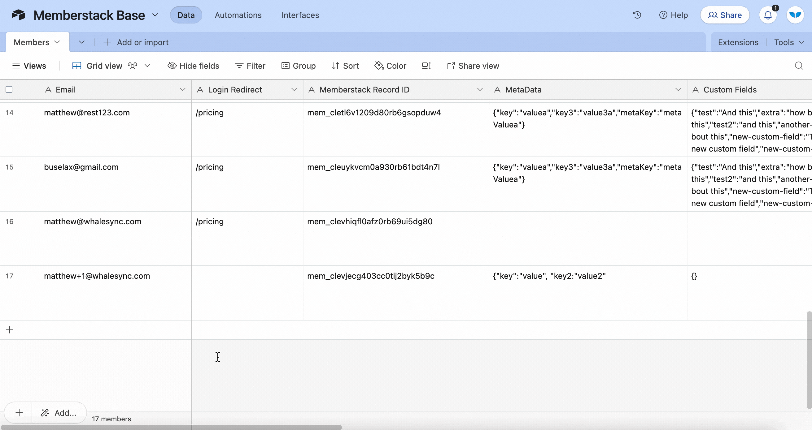

# Creating users via Whalesync

<figure><figcaption></figcaption></figure>

#### About creating users

Whalesync supports syncing with memberships apps like Memberstack and Webflow Memberships. When syncing with these apps we allow you to create users.

For example, you can add a new user in Airtable and have that create a new member in Memberstack (:tada:).

#### "Write-once" fields

<figure><figcaption></figcaption></figure>

* The email field for membership apps like Memberstack is what's called a "write-once" field.
* You can create new emails from both connected apps (e.g. Memberstack or Airtable)
* But once an email has been created, it cannot be updated

If you try to update a "write-once" field, you'll get an issue like this:

_"Please set the email address back from john2@gmail.com to john@gmail.com"_

#### Record sync delay

Write-once fields can normally cause issues if synced with an app like Airtable since Airtable saves every keystroke. The result can be sending a partial email to Memberstack (e.g. "john@gmai".)

To avoid this issue, we default to a record sync delay of 30 seconds for these types of tables. See the record sync delay page for more details:


[Broken link](broken-reference)


