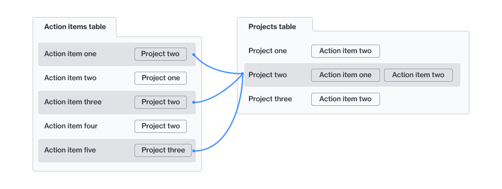
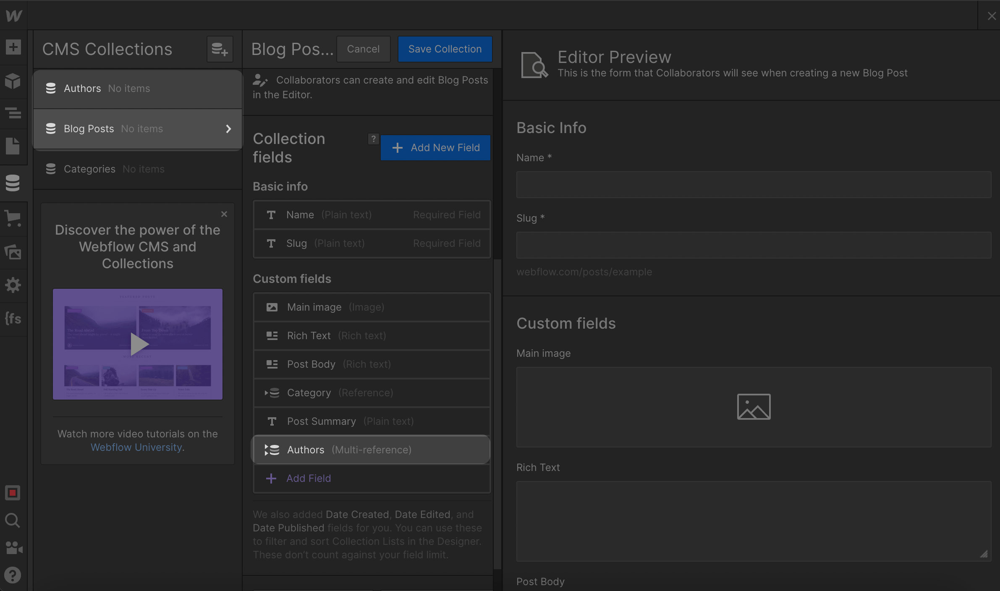

# Reference fields

## What are reference fields?

When setting up a database, it's incredibly powerful to relate data across tables. Fields that enable these cross-table relations are typically called _foreign keys_. In the no-code world, each app has coined its own term for this:

* Airtable = [_linked record fields_](https://www.airtable.com/guides/build/connect-data-with-linked-records)
* HubSpot = [_association fields_](https://knowledge.hubspot.com/records/associate-records)
* Notion = [_relation fields_](https://www.notion.so/help/relations-and-rollups)
* Webflow = [_reference fields_](https://help.webflow.com/hc/en-us/articles/33961317363091-Reference-field-overview)

### How to sync reference fields with Whalesync


A tutorial on how to sync reference fields (aka foreign keys) in Whalesync


### Things to keep in mind


**You must map compatible reference fields**

For example Airtable linked record fields must be mapped to Webflow reference fields


One of Whalesync's most popular features is the ability to sync reference fields out of the box. This means you can easily sync Airtable linked record fields with Webflow reference fields ✨.


**When syncing reference fields** **you must also sync the table that is being referenced**


Let's look at a Webflow example. Imagine you have a Blog Posts collection with a multi-reference field to an Authors collection.

In order for that Authors _**field**_ to sync, you must make sure to map the Authors _**table**_ in Whalesync as well.

## Reference field best practices

Syncing reference fields with Whalesync is powerful, but there are some things to keep in mind when setting up your sync to provide the best experience.

### Reference fields should only contain a small number of entries

Let's say you have two tables: "People" and "Companies". These tables are related in that people work for companies. You can choose to have a reference field on "People" that points to "Companies", or have a field on "Companies" that points to "People". Which should you do?

_You should have a field on "People" that points to "Companies"._ Each person only works for one or a few companies, whereas a company may have hundreds or thousands of people working there.

Many apps, like Notion, only allow you to have a small number of reference field entries. If you sync a "companies" field in the "People" table, you'll be smooth sailing. If you sync a "people" field in the "Companies" table, it's very likely that you'll run into sync issues that will prevent your records from fully syncing over.

If you're using a flexible app like Airtable or Postgres and have a situation where two tables (A and B) have a relationship that will result in many reference field entries on both sides, then you can use a technique known as an [association table](https://en.wikipedia.org/wiki/Associative_entity). Instead of A pointing to B directly(or vice versa), an association table has entries that track each time a record from A needs to be linked to a record from B.

### Only sync one side of a mirrored reference field relationship

Many apps, like Airtable and Notion, offer the ability to have reference fields that are mirrored between two tables:

* "People" will have a "companies" field
* "Companies" will have a "people" field

Changing a value in one field will automatically update the other.

This gets tricky from a data syncing perspective. _It's best to only choose one of those fields to sync, not both._

This is for multiple reasons:

* One side often has many more reference fields to sync which could go over field limits (e.g. Notion, see previous tip)
* Every change in one field results in an equivalent change in the opposite field, resulting in unnecessary syncing work (and thus slower syncing)

Which side do you choose? _It's best to choose the side that has fewer reference field entries._ In the above example, the "companies" field of the "People" would have fewer entries because people only are associated with a small number of companies, whereas a company often has hundreds or thousands of people.
