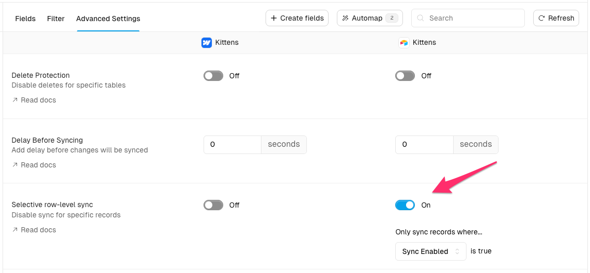

# Selective row-level sync

## Overview

Selective row-level sync lets you pause syncing for individual records without turning off your whole sync. Add a checkbox field (e.g., "Sync Enabled") in the source app you want to control from. When the box is unchecked, Whalesync will not sync that record. Re-check it and Whalesync will resume syncing the record.

## How to enable selective row-level sync

1. Edit your Whalesync base
2. Select the desired table
3. Open the **Advanced settings** tab
4. Enable the "Selective row-level sync" toggle for the app you want to control from
5. Choose the field that you want to use to control syncing. Only [compatible fields](#compatible_columns) will be available.
6. Save changes

### How it works

- When the control field is checked, the record syncs normally.
- When the control field is unchecked, syncing is paused for that record.
- While paused, changes from either app are ignored for that record.
- When re-enabled, Whalesync resumes syncing the record.


The control field should not be a mapped column.


### Compatible fields {#compatible_columns}

Only checkbox or boolean fields are eligible to use to control row-level syncing.

Examples by app:

- Airtable: Checkbox
- Notion: Checkbox
- Webflow: Switch
- Postgres & Supabase: boolean
- Google Sheets: boolean

## Behavior details

- Paused means Whalesync detects the change but purposefully ignores it for that record.
- The pause applies bi-directionally: edits in either connected app will not sync while paused.
- Re-enabling resumes normal behavior. If both sides changed while paused, the most recent changes win (per Whalesync's versioning).
- The sync overview can display how many records are currently paused in a table.

## FAQs

### Do I need to map the control field to the other app?

No. The control field should only exist on the side you want to control from and should not be mapped.

### What happens if I edit a paused record on the other app?

Changes are ignored while paused. When you re-enable syncing, edits made in either app will sync. If the same field was edited in both apps, the most recent change wins.

### Can I use filters with selective row-level sync?

Yes. Table filters and selective row-level sync are additive. If a record is filtered out, it will not sync regardless of the control field.

### Does this replace using a "Draft" status in my CMS?

No. Draft status may hide content on your site. Selective row-level sync simply pauses syncing, so your live content can remain published while you edit.
