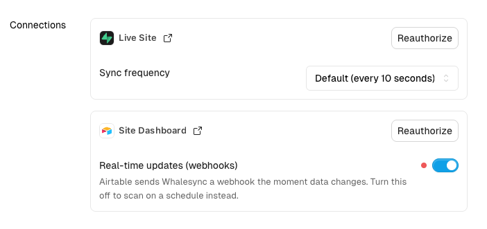
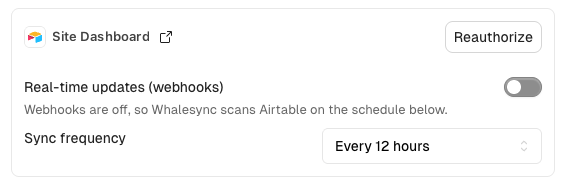
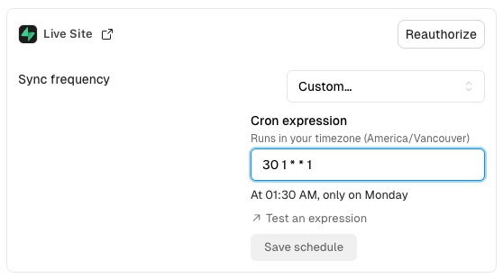

# Sync frequency

Sync frequency controls how often Whalesync scans a connection for changes. You set it per connection, in your sync's **Settings** tab under **Connections**.

Each connection defaults to the fastest frequency supported. You can slow a connection down, which reduces how often Whalesync calls that app's API. This is useful when an app has strict API limits, or when you want to control when changes propagate.

<figure><figcaption>
Each connection shows its current sync frequency
</figcaption></figure>

### Real-time updates (webhooks)

When an app supports webhooks, it sends Whalesync a notification the moment data changes. Whalesync processes those changes as they arrive, so there's no scan interval to set.

While real-time updates are on, the **Sync frequency** option is hidden for that connection.

Turn **Real-time updates (webhooks)** off if you'd rather scan on a schedule. The sync frequency option appears once webhooks are disabled.

<figure><figcaption>
With webhooks off, Whalesync scans on the schedule you choose
</figcaption></figure>

### Choosing a frequency

Two kinds of schedule are available:

- **Interval** — scan on a fixed cadence, such as every 12 hours.
- **Custom (cron)** — scan on a cron schedule, such as midnight every day. Choose **Custom…** and enter a cron expression.

Cron expressions run in your account's timezone. Whalesync shows a summary of the expression you entered so you can confirm it's what you meant.

<figure><figcaption>
Custom cron schedules run in your account's timezone
</figcaption></figure>

You can set a connection to scan less often than the default, but not more often.
