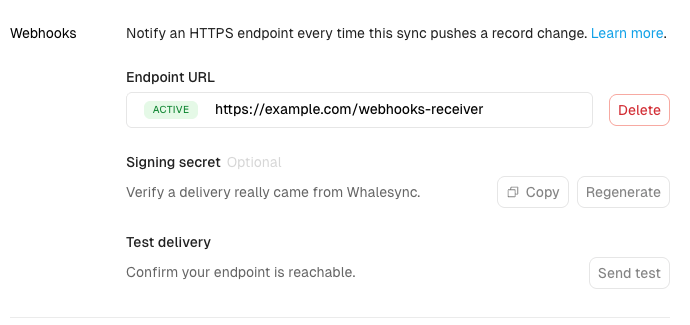

# Sync webhooks

Sync webhooks notify your own endpoint every time Whalesync pushes a change to your data. Whenever a record is created, updated, or deleted by your sync, Whalesync sends an HTTP POST to a URL you choose. Use it to trigger cache rebuilds, audit logs, Slack alerts, or any downstream automation.

Every event corresponds to an operation you'd see in your sync's Operations feed.

### Setting it up

Open your sync, go to the **Settings** tab, and find the **Webhooks** section.

<figure><figcaption><p>The Webhooks section under a sync's Settings tab</p></figcaption></figure>

1. Under **Endpoint URL**, enter your HTTPS endpoint and save it. Whalesync sends a test event to confirm the endpoint is reachable; once it responds with a 2xx status, the endpoint shows as **Active**. If it doesn't respond, fix your endpoint and save again.
2. (Optional) Under **Signing secret**, click **Copy** to grab the secret (it starts with `whsec_`) so you can verify that a delivery really came from Whalesync. Use **Regenerate** to roll it at any time.
3. Under **Test delivery**, click **Send test** at any time to fire a sample payload and confirm your endpoint is reachable.

### The message structure

Events are delivered in batches. One POST contains up to 100 events, in the order the operations happened. Your endpoint receives JSON like this:

```json
{
  "deliveryId": "dl_01J8Z9KQ...",
  "sync": { "id": "9b1f...", "name": "Airtable ↔ Webflow" },
  "events": [
    {
      "id": "evt_01J8Z9KR...",
      "type": "record.updated",
      "occurredAt": "2026-07-31T18:02:11.532Z",
      "whalesyncRecordId": "cmr_7f3a...",
      "source": {
        "connector": "airtable",
        "tableId": "tblXXXXXXXX",
        "recordId": "recXXXXXXXX"
      },
      "destination": {
        "connector": "webflow",
        "tableId": "65f2ab...",
        "recordId": "66a1cd..."
      },
      "changedFields": ["5f3ca1...", "9c81d2..."]
    }
  ]
}
```

- `type` is one of `record.created`, `record.updated`, or `record.deleted`
- `source` and `destination` identify the record on each side of the sync, using the IDs from the connected apps
- `whalesyncRecordId` is Whalesync's own ID for the record. It stays the same across the record's lifetime, on both sides of the sync
- `changedFields` lists the IDs of the destination fields that were pushed, as defined in the destination app. Field IDs are stable across renames and are what the destination's API expects. For creates it lists all pushed fields; for deletes it's empty

Payloads contain IDs, never field values. If you need the data itself, fetch the record from your app using the IDs in the event.

### Delivery guarantees

- **Ordered.** Whalesync keeps a cursor into your sync's operation history and delivers events in order. A new batch isn't sent until the previous one succeeds.
- **At least once.** Rarely, the same event can be delivered twice. Deduplicate by the event `id` if that matters for your use case.
- **Respond fast.** Reply with any 2xx status within 10 seconds. Do slow processing after responding, not before.

### Source IP address

Webhook deliveries come from the same static outbound IP address Whalesync uses for database traffic: `34.66.3.22`. If your endpoint sits behind a firewall or IP allowlist, add this address. See [Allowlisting Whalesync IP addresses](../../resources/support/allowlist-ip.md) for details.

### Verifying signatures

Signing is optional, but recommended. If you've set a **Signing secret**, each request includes a signature header:

```
Whalesync-Signature: t=1722448800,v1=5257a869e7...
```

`v1` is an HMAC-SHA256 of `{t}.{raw request body}` using your `whsec_` secret. Verify it before trusting the payload, and reject requests where `t` is more than 5 minutes old. For example, in Node.js:

```javascript
const crypto = require('crypto');

function verify(secret, header, rawBody) {
  const { t, v1 } = Object.fromEntries(header.split(',').map((p) => p.split('=')));
  const expected = crypto.createHmac('sha256', secret).update(`${t}.${rawBody}`).digest('hex');
  return crypto.timingSafeEqual(Buffer.from(expected), Buffer.from(v1));
}
```

You can copy or regenerate the secret at any time with **Copy** and **Regenerate** in the Webhooks section.

### Retries and automatic disabling

If your endpoint fails (a non-2xx response, or no response within 10 seconds), Whalesync retries the same batch with increasing delays, up to once per hour. Because delivery is ordered, later events wait until the failing batch goes through.

If your endpoint keeps failing:

- After **24 hours** of continuous failures, Whalesync emails you a warning
- After **72 hours**, the webhook is disabled and you get a final email

The Webhooks section in your sync settings always shows the current health: **Active**, **Failing** (with the latest error), or **Disabled** (with the reason).

To turn a disabled webhook back on, fix your endpoint and click **Re-enable**. Delivery resumes from that moment. Events that occurred while the webhook was disabled are skipped, and the UI tells you how many were missed.
