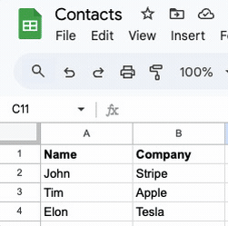

# Filters

<figure><figcaption>
Adding a filter that will only sync records when a particular field is true
</figcaption></figure>

### Filter settings can only be edited _before_ the initial sync

When you are creating a new table mapping, you are able to set filters. Once data in those tables sync, you cannot change the filter settings.

<figure><figcaption></figcaption></figure>

### Filters sync the _final_ update before future updates are excluded

For instance, if you change a record from ‘John’ to ‘Sarah’ in Google Sheets, Whalesync will sync this last update to Affinity. After that final sync, changes to the now 'Sarah' record will be filtered out.

<figure><figcaption>
Updating a record in a way that removes it from the filter
</figcaption></figure>

## FAQ

### **Will setting a filter delete any of my existing data?**

No, adding a filter won’t remove existing data. Filters apply to any _future_ updates.

### **Are filters case sensitive?**

Yes.

<figure><figcaption>
This will only sync records that equal "John" and will not sync records that equal "john"
</figcaption></figure>

### **How should I write percentage values?**

Percentage values should be written as numbers.

<figure><figcaption>
This will only sync records that have a "Percent" value above 10%
</figcaption></figure>

### Is there any way I can edit a filter after the initial sync?

Unfortunately Whalesync does not support editing a sync filter after a sync has been turned on. However, by using [record matching](record-matching.md), you can work around this.

Let's say you have a sync between App A and App B. By deleting the existing sync and creating a new sync, you can effectively edit the filter:

1. Make sure that all records in synced tables have a unique identifier that can be used for record matching
2. Delete the original sync between App A and App B
3. Create a new sync between App A and App B
4. Create the desired filter
5. When asked how you wish to match up existing records (via [record matching](record-matching.md)), choose the unique identifier you made a note of in step 1

Now you should have a working sync that has the same configuration as the original sync, but with the new filter.

