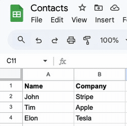

# Filters

<figure><figcaption>
Adding a filter that will only sync records when a particular field is true
</figcaption></figure>

### Filters can be changed at any time

You can set filters when you create a table mapping, and you can change them later by pausing the sync.

Because a new filter applies to records that have already synced, Whalesync needs to look at every record again. When you turn the sync back on it runs another initial sync, and the preview tells you how many records will start syncing and how many will stop before anything is applied.

### Filters sync the _final_ update before future updates are excluded

For instance, if you change a record from ‘John’ to ‘Sarah’ in Google Sheets, Whalesync will sync this last update to Affinity. After that final sync, changes to the now 'Sarah' record will be filtered out.

<figure><figcaption>
Updating a record in a way that removes it from the filter
</figcaption></figure>

## FAQ

### **Will setting a filter delete any of my existing data?**

No, adding a filter won’t remove existing data. Filters apply to any _future_ updates.

### **Are filters case sensitive?**

Yes.

<figure><figcaption>
This will only sync records that equal "John" and will not sync records that equal "john"
</figcaption></figure>

### **How should I write percentage values?**

Percentage values should be written as numbers.

<figure><figcaption>
This will only sync records that have a "Percent" value above 10%
</figcaption></figure>

### What happens to records that stop matching when I change a filter?

They stop syncing, and nothing is deleted. Anything Whalesync already copied stays where it is, and later changes to those records no longer travel between your apps. Deleting one of them in one app no longer removes it from the other.

Records that match the new filter start syncing.

### Do I need to delete and rebuild my sync to change a filter?

No. Editing the filter on the table mapping is all you need. Earlier versions of Whalesync did require rebuilding the sync, but filters can now be changed on a sync that is already running.
