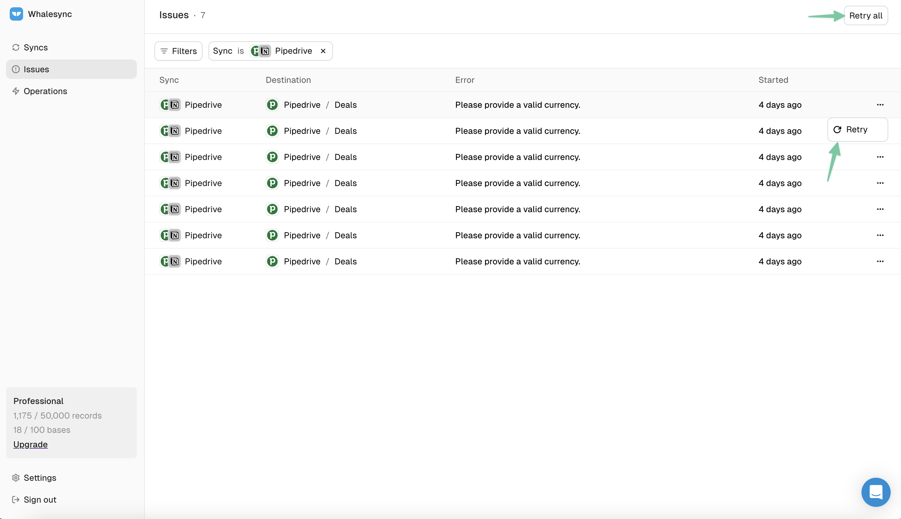

# Issues

<figure><figcaption>
 Issues page
</figcaption></figure>

The [Issues Page](https://app.whalesync.com/issues) shows any errors impacting your sync. Here you'll see a summary of each error including:

* Which service gave the error (eg. HubSpot)
* When the error started (eg. 50 minutes ago)
* The error message (eg. ValidationError: 'fields.name' is required)

### Issue Details

To troubleshoot, you can click into Issue Details and see:

* The specific record impacted by the issue
* The full error message from the service throwing the error
* An AI generated suggestion for how to fix it

<figure><figcaption>
Issue detail page showing an AI generated suggestion
</figcaption></figure>

### Retry Sync

Once you've troubleshooted an Issue, you can retry syncing for that record by clicking the retry button.

<figure><figcaption>
Retry and Retry All buttons
</figcaption></figure>
