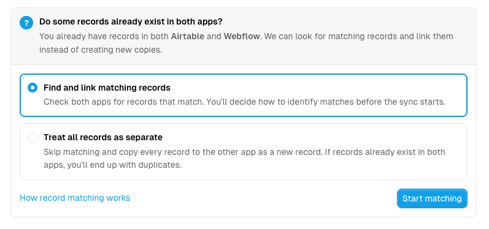
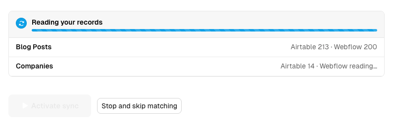
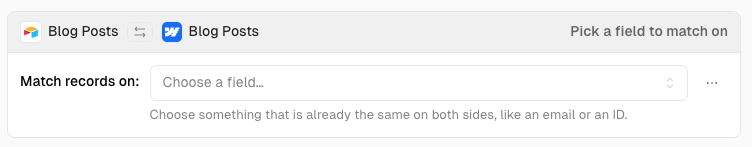
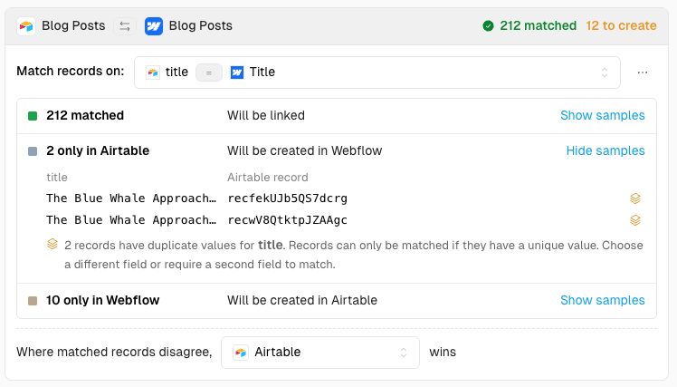
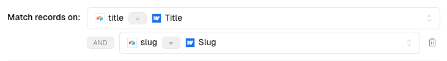
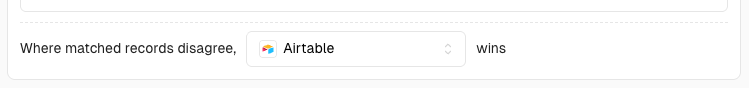

# Record matching

Record matching tells Whalesync which records in one app are the same records in the other app. It appears on the Activate step, the last step of creating a sync, and only when a table already holds records on both sides. Whalesync links the records you match and creates the ones you don't.

Matching runs once, during the initial sync. It cannot be redone afterward, so read the results before you activate.


**Matching is your one chance to avoid duplicates.** If the same records exist in both apps and you activate without matching them, every record is copied to the other app as a new record. The only way to undo that is to delete the duplicates by hand.


### Deciding whether to match

When you reach the Activate step, Whalesync checks every table in the sync for records on each side. The table list shows "Analyzing…" while it does.

If records exist in only one app, or in neither, there is nothing to match. The page shows "No records to match up" and tells you what activation will do for each table, such as "Records from Airtable will be created in Webflow" or "No records in either app yet". Click **Activate sync** and syncing starts.

If at least one table has records in both apps, the page asks "Do some records already exist in both apps?" and offers two choices:

* **Find and link matching records**, preselected. Whalesync reads every record from both apps and lets you choose how to identify matches before the sync starts. The button is **Start matching**.
* **Treat all records as separate.** Whalesync skips matching and copies every record to the other app as a new record. If the same records exist in both apps, this creates duplicates. The button is **Skip matching**.

This is one decision for the whole sync. You can still treat a single table's records as separate later, in the matching results.

<figure><figcaption>
The Activate step asks whether records already exist in both apps before matching
</figcaption></figure>

The Activate step also appears whenever a sync needs an initial sync again, such as after you add a table to a paused sync.

#### Reading your records

After **Start matching**, Whalesync reads every record from both apps for the tables involved and shows progress per table. Large tables can take a while. You can close the page and come back; Whalesync emails you when the scan finishes. **Stop and skip matching** cancels it.

Tables and field mappings are locked during the scan. Changing them discards the scan.

If reading fails, the page says so and offers **Retry** or **Skip matching**.

<figure><figcaption>
Whalesync reads every record from both apps, table by table, before matching
</figcaption></figure>

### Choosing a match field

Once your records are read, the **Matched records** panel shows one card per table. Each card has a **Match records on:** picker listing the mapped fields, shown as "left field = right field". Pick the field that identifies a record on both sides, such as an email address or an ID.

Choosing a field runs matching for that table right away, and only that table. Results appear in the card within seconds. Large tables show "Still matching — this can take a while for large tables."

<figure><figcaption>
A table card before a match field is chosen
</figcaption></figure>

A good match field is unique within each app and already identical on both sides. Matching is exact:

* Values must be identical, including case and spacing. "ana@example.com" does not match "Ana@example.com ".
* Empty values never match anything, including other empty values.
* Records that share a value with another record cannot be matched. See [Reading the results](#reading-the-results).

Fields that cannot be used for matching are disabled in the picker. This includes linked and relation fields and file URLs that expire.

Below a divider, the picker also offers **Treat all records as separate** for that one table. Choosing it shows how many records will be created and repeats the duplicates warning.

**Activate sync** stays disabled until every table with records on both sides has either a match field or an explicit "treat as separate" choice. The button's tooltip says so.

### Reading the results

The card header gives the verdict at a glance: how many records matched, in green, and how many will be created, in orange. A table that matched cleanly shows only the matched count. Below the picker, the same three rows appear every time.

| Row                    | What happens on activation                                                                                                       |
| ---------------------- | -------------------------------------------------------------------------------------------------------------------------------- |
| N matched              | "Will be linked". Whalesync treats each pair as one record from then on.                                                           |
| N only in \[first app]  | "Will be created in \[other app]". On a one-way sync that flows the other way, the row says "Won't be created" instead.              |
| N only in \[other app]  | The same, for the other side.                                                                                                      |

Each non-empty row has **Show samples**, which lists up to ten of its records with the match-field value and the record ID, and says how many of the total are shown. Empty values appear as `<empty>`.

A record whose match value is shared with another record gets a stack icon and a note: "2 records have duplicate values for title. Records can only be matched if they have a unique value. Choose a different field or require a second field to match." Those records count as "only in" their app and will be created, not linked.

"No records matched", or a "to create" number larger than you expect, means the field you chose does not identify your records well. Pick a different field rather than activating.

<figure><figcaption>
Matching results for Blog Posts. The two unmatched Airtable records share a title, so they cannot be matched
</figcaption></figure>

### Requiring a second field

If the field you chose is not unique, open the **⋯** menu next to the picker and choose **Require a second field to match**. A second picker appears, joined to the first by an **AND** badge.

A record then matches only when both fields are equal on both sides. The second field is not a fallback; Whalesync does not try the first field and then the second. Matching re-runs for that table as soon as you choose the second field. Removing the second field returns the table to single-field matching.

<figure><figcaption>
With a second field required, a record matches only when both title and slug are equal
</figcaption></figure>

### When matched records disagree

Once a table has at least one match, the card shows a setting: **Where matched records disagree, \[app] wins.** It decides which app's values are kept when a linked pair holds different data in a synced field during the initial sync.

The setting applies only to matched records, and only to fields other than the match fields, which already agree by definition. On a one-way table there is no choice: the app records flow from always wins, and the row says "this table syncs one way".

<figure><figcaption>
Airtable values are kept where a matched pair disagrees
</figcaption></figure>

### Rescanning and activating

The **Matched records** header shows when your records were read, such as "Read 2,340 records at 3:12 PM · Rescan". **Rescan** reads both apps again and re-runs matching with the same match fields. Use it if records changed in either app after the scan. If the last scan was slow, Whalesync asks you to confirm first.

**Activate sync** links the matched records, creates the unmatched ones, and turns on the ongoing sync. Its tooltip in this state reads "Matching runs once and can't be redone." You then land on the sync overview, where a banner shows initial sync progress.

### Tips

**Match on IDs whenever you can.** If each app stores the other app's record ID in a text field, matching on that field gives an exact match for every record. See [store-record-ids-on-both-sides.md](store-record-ids-on-both-sides.md "mention").

**Check the samples before activating.** They are the fastest way to see that you picked the right field, especially on a table where only some records matched.

**If you already activated without matching,** matching cannot be run again for those records. The only fix is to remove the duplicates by hand.
