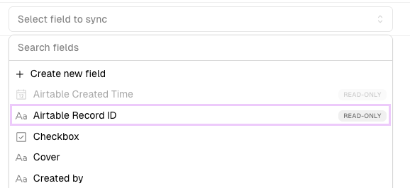
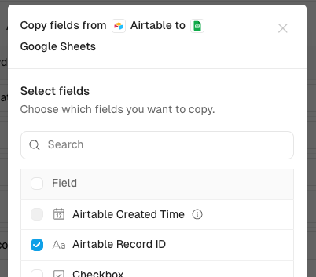
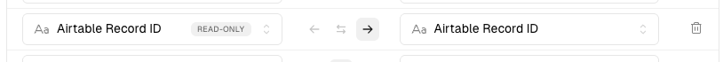

# Store record IDs on both sides of a sync


**Best practice.** This page describes a recommended setup, not a requirement. Whalesync tracks record pairs on its own. Storing the IDs in your apps gives you a copy of that link you can use without Whalesync, and it takes two extra field mappings to set up.


Every table Whalesync reads has a built-in, read-only field named "\<App> Record ID", such as "Airtable Record ID" or "Webflow Record ID". It holds the app's native ID for each record. We recommend mapping that field into a plain text field on the opposite side of your sync, in both directions, so every record carries a durable pointer to its counterpart.

### Why store record IDs

**Stable join key.** Native record IDs never change. Names, emails, and slugs get edited, and matching on them breaks the moment someone renames a record. An ID keeps pointing at the same record for its whole life.

**Painless re-matching.** If a sync is ever paused, rebuilt, or recreated, the stored IDs let you re-match existing records exactly instead of matching by name or email. See [record-matching.md](record-matching.md "mention").

**Faster debugging.** When a record looks wrong, you can jump straight from it to its twin in the other app without opening Whalesync.

**Downstream work.** Deep links into the other app, external API calls, and reconciliation audits all become possible without querying Whalesync.

### How to set it up

#### 1. Find the ID field

In the field mapper, each table has an "\<App> Record ID" field in its field list. The list is alphabetical, so look under the app's name. The field is tagged read-only. It is not a field that exists in the app itself. Whalesync fills it in for you.

<figure><figcaption>
The built-in "Airtable Record ID" field in the field picker, tagged read-only
</figcaption></figure>

If you want to see the ID inside the app itself, see [how-to-get-record-ids.md](../resources/support/how-to-get-record-ids.md "mention"). You do not need to do this to set up the mapping.

#### 2. Create the receiving fields

Add a plain text field on each side to hold the other app's ID. Name it after the app whose ID it stores, for example "Airtable ID" in Webflow and "Webflow ID" in Airtable.

You can create this field from the mapper instead of in the app. Choose **Create new field** at the top of the field picker. This opens the Copy fields dialog. Tick the Record ID field and Whalesync adds a matching text field on the other side for you.

<figure><figcaption>
Copying the "Airtable Record ID" field into Google Sheets from the mapper
</figcaption></figure>

#### 3. Map them

Map App A's "App A Record ID" to App B's text field, and App B's "App B Record ID" to App A's text field. For an Airtable and Webflow sync, that is:

- "Airtable Record ID" to "Airtable ID" in Webflow
- "Webflow Record ID" to "Webflow ID" in Airtable

Each mapping is one-way, from the app that owns the ID. The mapper sets this direction automatically because the Record ID field is read-only. See the read-only fields note on [two-way-sync.md](two-way-sync.md#read-only-fields "mention").

<figure><figcaption>
One of the two mappings. The direction is one-way from Airtable because the Record ID field is read-only
</figcaption></figure>


**These two mappings are one-way by design.** Whalesync fills the text field on the other side and keeps it updated. Nothing you type into the text field flows back.


### FAQ

#### Can I edit the text field that holds the other app's ID?

No. It is only synced one-way and should be treated as read-only in the app.

#### Is it safe to add these mappings to an existing sync?

Yes. Whalesync back-fills the ID for every record that is already synced. You do not need a separate one-way sync or a manual population step.

#### What about records that exist on only one side?

Their ID field is filled when Whalesync creates the counterpart record in the other app.
