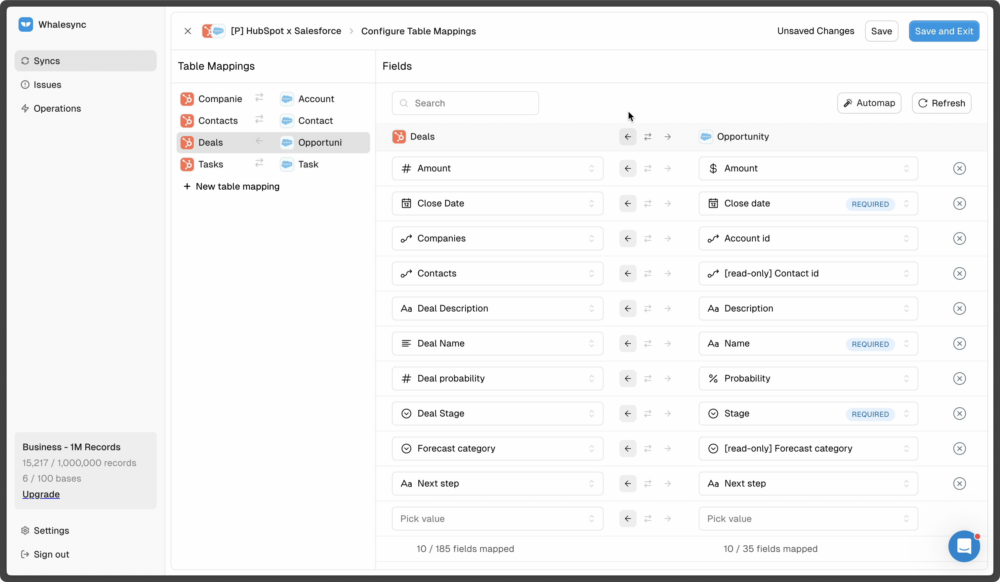

# Two-way sync

<figure><figcaption></figcaption></figure>

Whalesync offers true two-way sync. Once set up, you can update data in either connected app and it will sync to the other in real-time.&#x20;

When creating a new Whalesync base, two-way sync is easy to configure. Simply toggle the direction arrows to two-way:

<figure><figcaption></figcaption></figure>

### Read-Only Fields


**Two-way sync is not compatible with "read-only" field types**


There are certain field types you cannot sync data into. For example, a formula field cannot be overwritten. We call these "read-only" field types and tag them in the setup flow:

<figure><figcaption></figcaption></figure>

If you map a read-only field and choose two-way sync, that read-only field will be one-way while the rest of your fields remain two-way.

| Example read-only field types |
| ----------------------------- |
| Formula                       |
| Lookup                        |
| Rollout                       |
| Count                         |
| Created Time                  |
| Last Modified Time            |
| Autonumber                    |
