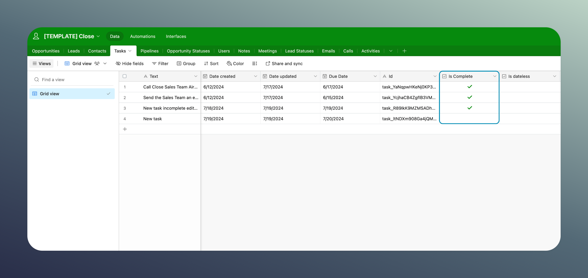


**Archived:** This connector is no longer offered by Whalesync. Existing syncs will continue to run, but future improvements and support will be limited. See [Previous Connectors](./) for more details.


# Close

## Supported Objects

<table><thead><tr><th>Tables</th><th>Status<select><option value="e06f8215296841cbb9b56300554bc898" label="✅ Supported" color="blue"></option><option value="26a18353ef33429b8325cf29bcbeeb54" label="➡️ Supported (1-way)" color="blue"></option><option value="17ee2063f0304528872db331d6c89a93" label="✅ Supported (as JSON)" color="blue"></option><option value="c915e2668c0b48a88fada9c39263f0c1" label="✖️ Not supported" color="blue"></option></select></th><th data-hidden></th></tr></thead><tbody><tr><td>🤝 Opportunities</td><td>✅ Supported</td><td></td></tr><tr><td>👥 Leads</td><td>✅ Supported</td><td></td></tr><tr><td>👤 Contacts</td><td>✅ Supported</td><td></td></tr><tr><td>✅ Tasks</td><td>✅ Supported</td><td></td></tr><tr><td>🎛️ Pipelines</td><td>✅ Supported</td><td></td></tr><tr><td>🎲  Opportunity Statuses</td><td>➡️ Supported (1-way)</td><td></td></tr><tr><td>👥 Users</td><td>➡️ Supported (1-way)</td><td></td></tr><tr><td>🗒️ Notes</td><td>✅ Supported</td><td></td></tr><tr><td>📅 Meetings</td><td>➡️ Supported (1-way)</td><td></td></tr><tr><td>📊 Lead Statuses</td><td>➡️ Supported (1-way)</td><td></td></tr><tr><td>✉️ Emails</td><td>✅ Supported</td><td></td></tr><tr><td>📞 Calls</td><td>✅ Supported</td><td></td></tr><tr><td>🏃‍♂️ Activities</td><td>➡️ Supported (1-way)</td><td></td></tr></tbody></table>

### Things to Keep in Mind


Record deletes for the 'Tasks' table are synced by updating the "is\_complete" property on the destination app (i.e Airtable, Notion).


<figure><figcaption></figcaption></figure>
