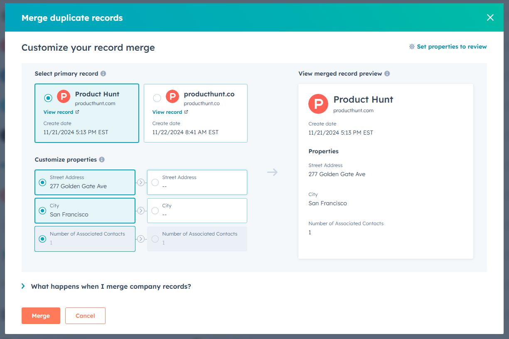


**Archived:** This connector is no longer offered by Whalesync. Existing syncs will continue to run, but future improvements and support will be limited. See [Previous Connectors](../) for more details.


# Merging records

In HubSpot, you have the ability to merge duplicate records.

<figure><figcaption>
Screenshot of merging records in HubSpot
</figcaption></figure>

From Whalesync's perspective, here's what happens when merging records:

* HubSpot deletes both of the original records
* HubSpot creates a new record with the properties of the two original records merged in

If you're syncing records to a spreadsheet like Airtable, Google Sheets, or Notion, the following will happen:

* Whalesync will delete both of the original records
* Whalesync will create a new record

If you're using the merge record feature of HubSpot, **please take care if you have non-synced fields** in your spreadsheet, since the **original spreadsheet records will be deleted**.
