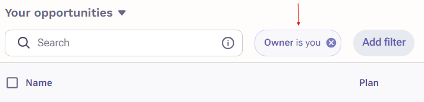

# Outreach

<figure><figcaption></figcaption></figure>

## Supported Objects

<table><thead><tr><th>Tables</th><th>Status<select><option value="e06f8215296841cbb9b56300554bc898" label="✅ Supported" color="blue"></option><option value="26a18353ef33429b8325cf29bcbeeb54" label="➡️ Supported (1-way)" color="blue"></option><option value="17ee2063f0304528872db331d6c89a93" label="✅ Supported (as JSON)" color="blue"></option><option value="c915e2668c0b48a88fada9c39263f0c1" label="✖️ Not supported" color="blue"></option></select></th><th data-hidden></th></tr></thead><tbody><tr><td>👤 Accounts</td><td>✅ Supported</td><td></td></tr><tr><td>✉️ Companies</td><td>✅ Supported</td><td></td></tr><tr><td>🤝 Opportunities</td><td>✅ Supported</td><td></td></tr><tr><td>👥 Prospects</td><td>✅ Supported</td><td></td></tr></tbody></table>

## Things to Keep in Mind

### Outreach sets an "Owner is You" filter by default&#x20;

To view all synced records, make sure you remove the "Owner" filter.&#x20;

<figure><figcaption></figcaption></figure>

### For Prospects, "Name" is a read-only field

To change how a name looks in Prospects from a synced connector, you should edit the "First Name" and "Last Name" fields.
