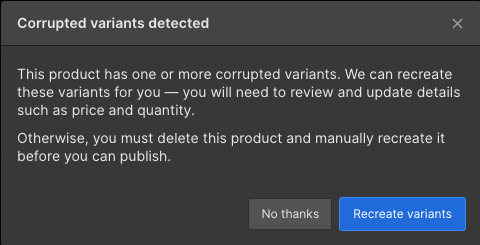

# Webflow E-Commerce

## Supported Collections

<table><thead><tr><th>Field</th><th>Status<select><option value="6c90dea3d4b34f409e73be79b7076c4a" label="✖️ Not Yet" color="blue"></option><option value="9e01356060cc4ea4988d69f72fe19d39" label="✅ Supported" color="blue"></option><option value="bd4357bee12749d0b80f7bc4a94ec3b5" label="➡️ Supported (1-Way)" color="blue"></option></select></th><th data-hidden></th></tr></thead><tbody><tr><td>📦 Products</td><td>✅ Supported</td><td></td></tr><tr><td>#️ Variants</td><td>✅ Supported</td><td></td></tr><tr><td>🔽 Categories</td><td>✅ Supported</td><td></td></tr><tr><td>🎨 Product Options</td><td>✅ Supported</td><td></td></tr><tr><td>📂 Product Option Sets</td><td>✅ Supported</td><td></td></tr><tr><td>🏷️ Discounts</td><td>✖️ Not Yet</td><td></td></tr><tr><td>🔢 Inventory</td><td>✖️ Not Yet</td><td></td></tr><tr><td>💸 Orders</td><td>✖️ Not Yet</td><td></td></tr><tr><td>💸 Subscriptions</td><td>✖️ Not Yet</td><td></td></tr></tbody></table>

## How to Set Up Webflow E-Comm 



## E-Commerce Specific Things to Keep in Mind 


**The "Products" collection in Webflow is split into four tables:**\
1\. Products\
2\. Variants\
3\. Product Option Sets\
4\. Product Options


Webflow E-Commerce's "Products" table is really a series of small tables. When managing Webflow E-Comm products from other apps (e.g. Airtable), you'll need to sync Products as the four separate tables below:

<figure><figcaption></figcaption></figure>

<figure><figcaption></figcaption></figure>


**You can edit Variants, Production Option Set, and Product Options in your other connector (e.g. Airtable) but you can't create new ones**


You can’t currently create new Variants, Product Option Sets, or Product Options in your other connector (e.g. Airtable). If you try to create them, they won’t sync across).

You _can_ create new Products though.


**Products created in Airtable will sync to Webflow as "staged for publish"**


Due to a limitation in Webflow's API, products created in Airtable will sync as "staged for publis&#x68;**"** rather than "published".

You will need to republish Webflow (or each product individually) for them to appear on your live site.&#x20;


**Webflow forces you to recreate variants if you delete Product Options or Option Sets**


After you delete Product Options (or Option Sets), Webflow will want to correspondingly adjust the set of variantss the next time you log in and open your Product in the Webflow Products table. It will give you a scarier-than-it-needs-to-be message saying that the variantss are corrupted, and offer to fix them. Click “Recreate variants”. As the message says, make sure the fields are set correctly after.

<figure><figcaption></figcaption></figure>

## General Webflow - Things to Keep in Mind 

See the "Things to Keep in Mind" section for Webflow:


