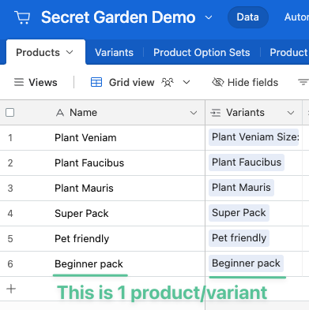

# Quick Start Guide: WF E-Comm

### 1) Start with our template

If syncing Webflow E-Comm with Airtable, we highly recommend starting with our Airtable template:


Click "Copy base" on the bottom right


### 2) (If not using the template) Make sure to add important tables&#x20;

You should have at least these five tables:

<figure><figcaption></figcaption></figure>


**The Variants table is necessary even if your products don't have variants**

Every product in Webflow has a "variant" even though Webflow doesn't show it.\
\
The Variant record of a Product stores important product information like price.


<figure><figcaption>
Example where a Webflow product doesn't "have variants" but really does under the hood
</figcaption></figure>

### 3) (If not using the template) Make sure to add an "Initial Variant - Price"

You will need to have an "Initial Variant - Price" field in your Products table.

See the below doc to understand why this field is necessary:


[how-to-create-products-and-variants.md](how-to-create-products-and-variants.md)


### 4) Read the 'Things to Keep in Mind'

The 'Things to Keep in Mind' section of the doc below walks through concepts that are important to Webflow E-Commerce.


[.](./)


### 5) Join our Slack channel

If you have any questions, don't hesitate to ask! We love to help :relaxed:.


