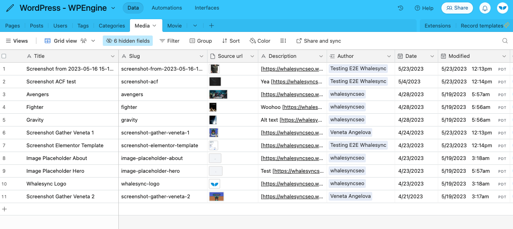
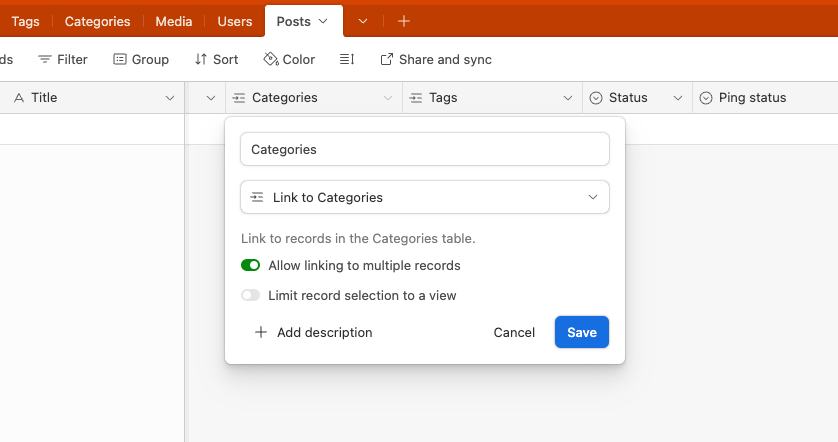

# Quick Start Guide: WordPress.org

### 1) Authorize with the _right_ user email and application password

See these docs :point\_down:


[authorize-wordpress.org.md](authorize-wordpress.org.md)


### 2) Start with our template

If syncing WordPress and Airtable, we recommend starting with our template which has all the tables and fields we support.



### 3) Create a Media table

In order to sync images in WordPress, you'll need to create a table called "Media" in your connected app. You can then add images to your Posts/Pages using linked records.

Our template already includes a Media table, but here's what it looks like:

<figure><figcaption>
Example WordPress Media table in Airtable
</figcaption></figure>

See the below docs for further explanation of supporting tables :point\_down:


[supporting-tables.md](supporting-tables.md)


### 4) Create tables for Categories and Tags

Similar to the Media table, Categories and Tags must exist as linked records on your Posts. Once again, if you're unsure about how this all works you can just copy our [Airtable template](https://www.whalesync.com/template-packs/wordpress-blog-3).&#x20;

<figure><figcaption>
Categories as a linked record on the Posts table
</figcaption></figure>

### 5) Toggle "show in REST API" to use Advanced Custom Fields (ACF)

Whalesync lets you sync Custom Posts and Custom Fields thru ACF using these steps :point\_down:


[advanced-custom-fields-acf.md](advanced-custom-fields-acf.md)


### 6) Monitor usage graphs

Once you turn sync on, we recommend monitoring your WordPress.org host (e.g. WP Engine or Kinsta) for the first few hours. These hosts typically have limits for billable visits and bandwidth that are worth monitoring.

### 7) Watch our video tutorial


