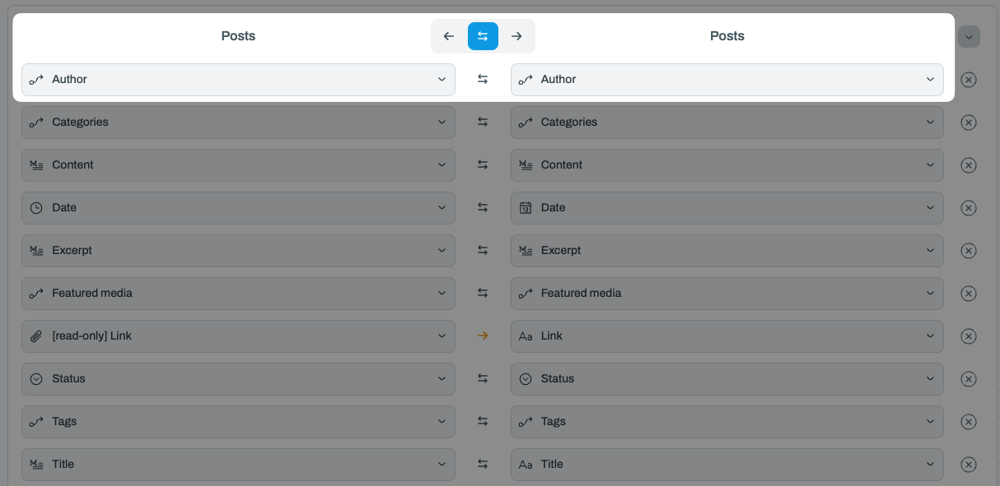

# Supporting tables

## Overview

There are six tables every WordPress instance has:

<table><thead><tr><th>Name</th><th>Type<select><option value="2cf6fc5309b64ecd8815745df5fcdaaa" label="Main" color="blue"></option><option value="9b401e0fa5c04bda85fd3486ce2cb75c" label="Supporting" color="blue"></option></select></th></tr></thead><tbody><tr><td>Pages</td><td>Main</td></tr><tr><td>Posts</td><td>Main</td></tr><tr><td>Users</td><td>Supporting</td></tr><tr><td>Categories</td><td>Supporting</td></tr><tr><td>Tags</td><td>Supporting</td></tr><tr><td>Media</td><td>Supporting</td></tr></tbody></table>

_(If you have Custom Posts enabled, you will see more tables for each Custom Post type)_

The star of your site are the Pages and Posts - everything else is there to support them.


**Tip:** We highly recommend that you map all four of the supporting tables in Whalesync!\
\
You can use our [Airtable template](https://www.whalesync.com/template-packs/wordpress-blog-3) which has all six tables pre-configured.


## Supporting Tables

### Users

The Users table lists all the users of your site. Tables like Media, Pages, Posts all have a field called Author that can point to a user in this list.&#x20;


**Note:** Whalesync does not support creating new users at this time. You will have to create new users in the WordPress UI.


#### How to set up the Users table in Airtable

_(Alternatively, you can use our_ [_template_](https://www.whalesync.com/template-packs/wordpress-blog-3)_, which has everything set up for you)_

1. In Airtable, create a table called "Users"
2.  In your Posts table, created a linked record field to Users called "Author"

    <figure><figcaption>
Airtable Posts table
</figcaption></figure>

3.  In Whalesync, map both the Users and Posts tables on the table mapping screen.

    <figure><figcaption>
Mapping the Posts and Users tables on the Whalesync table mapping screen
</figcaption></figure>
4.  Map the Author field in the Posts table.

    <figure><figcaption>
Mapping the Author field on the Posts table in Whalesync
</figcaption></figure>
5. Save and turn sync on!

:tada: Now all your Users will sync from WordPress to Airtable!

### Categories and Tags

Like the Users table, if you want to sync WordPress Categories and Tags, you'll need to set up supporting tables.


**Tip:** Make sure "allow linking to multiple records" is toggled so you can link multiple categories and tags.


<figure><figcaption></figcaption></figure>

### Media

Just like the other supporting tables above, you'll need to create a dedicated Media table in order to manage the media (e.g. images) of your WordPress posts.


**Note:** Whalesync does not support creating new media at this time. Any new images must be uploaded in WordPress and not Airtable.


Here is an example of how this would work with Airtable and Whalesync:

1. In WordPress, upload all the images you need in the Media page.
2. In Airtable, make sure you have a Media table with "Title" and "Source url" fields at minimum.
3. In Airtable, in the Pages and Posts tables make sure to add a "Featured media" column of a type linked record pointing to the Media table.
4. In Whalesync, make sure to map all relevant tables: Posts, Pages, Media.
5. In Whalesync, make sure to map all relevant fields: in Posts/Pages map the "Featured media" field in particular. In the Media table, map all your fields.
6. Save and turn sync on!

&#x20;:tada: In Airtable you can see all your images in the Media table, and for any Post or Page record that has an image associated with it, you will see it in the "Featured media" column. More importantly you can assign an image to a particular Post or Page from Airtable!

Here's an example of what the Media table looks like in Airtable:

<figure><figcaption></figcaption></figure>


**Tip:** Name your images in Airtable something simple and descriptive.

