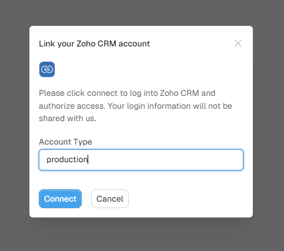


**Archived:** This connector is no longer offered by Whalesync. Existing syncs will continue to run, but future improvements and support will be limited. See [Previous Connectors](./) for more details.


# Zoho CRM

## Supported Objects

<table><thead><tr><th>Tables</th><th>Status<select><option value="e06f8215296841cbb9b56300554bc898" label="✅ Supported" color="blue"></option><option value="26a18353ef33429b8325cf29bcbeeb54" label="➡️ Supported (1-way)" color="blue"></option><option value="17ee2063f0304528872db331d6c89a93" label="✅ Supported (as JSON)" color="blue"></option><option value="c915e2668c0b48a88fada9c39263f0c1" label="✖️ Not supported" color="blue"></option></select></th><th data-hidden></th></tr></thead><tbody><tr><td>👥 Accounts</td><td>✅ Supported</td><td></td></tr><tr><td>📞 Calls</td><td>✅ Supported</td><td></td></tr><tr><td>🎛️ Campaigns</td><td>✅ Supported</td><td></td></tr><tr><td>👤 Contacts</td><td>✅ Supported</td><td></td></tr><tr><td>🤝 Deals</td><td>✅ Supported</td><td></td></tr><tr><td>📊 Deals by Pipeline</td><td>➡️ Supported (1-way)</td><td></td></tr><tr><td>👤 Leads</td><td>✅ Supported</td><td></td></tr><tr><td>💻 Meetings</td><td>✅ Supported</td><td></td></tr><tr><td>🗒️ Notes</td><td>✅ Supported</td><td></td></tr><tr><td>🏃‍♂️ Tasks</td><td>✅ Supported</td><td></td></tr><tr><td>👥 Users</td><td>✅ Supported</td><td></td></tr><tr><td>🏪 Vendors</td><td>✅ Supported</td><td></td></tr></tbody></table>

### Step-by-Step Guide



### Authorization Step

After selecting Zoho CRM from the list of apps to sync, type "production" in the window below to authorize Zoho successfully.&#x20;

<figure><figcaption></figcaption></figure>

### Zoho API Limits

Zoho CRM has fairly strict API limits every 24 hours:

<figure><figcaption>
<a href="https://www.zoho.com/crm/developer/docs/api/v6/api-limits.html">https://www.zoho.com/crm/developer/docs/api/v6/api-limits.html</a>
</figcaption></figure>

Due to Zoho CRM's limits, each Zoho CRM table you map in Whalesync has a maximum of 50 mapped fields. **You cannot map more than 50 fields in one table**.&#x20;

The more tables you map in Whalesync, the more API credits your sync will consume.

**We generally recommend only mapping up to 4 Zoho CRM tables** to ensure you do not surpass 50,000 Zoho CRM credits per day.
