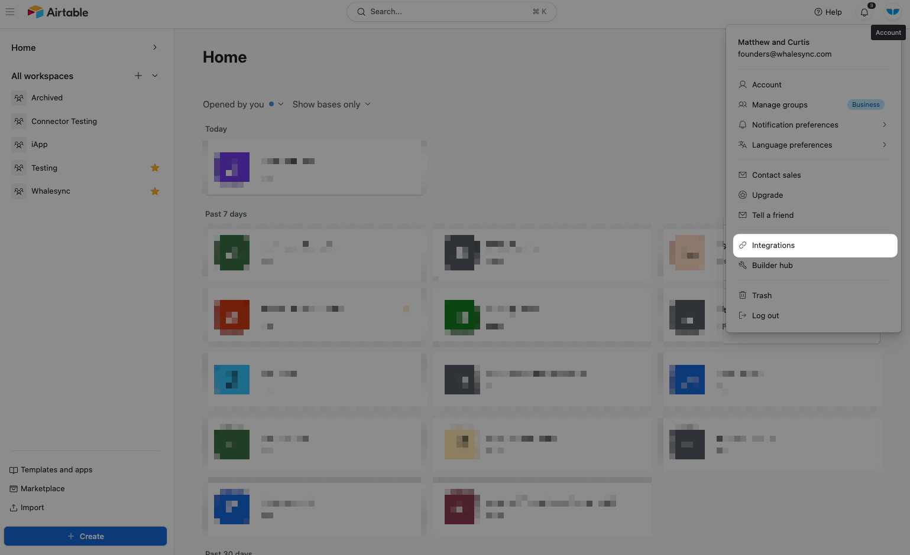
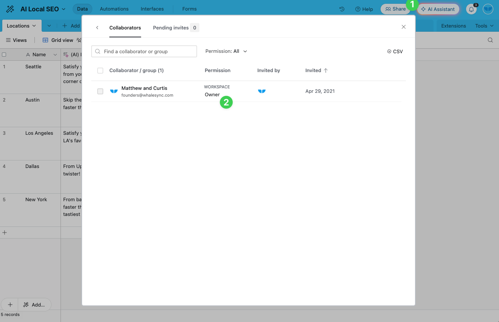

# Common errors - Airtable

### 1) "**You have reached the maximum access authorizations for this integration"**

This is an Airtable limitation that occurs during authorization and looks like this:

<figure><figcaption></figcaption></figure>

<mark style="color:green;">**Suggested Action:**</mark>

1. Delete old connections in Airtable
   1.  Click on your account > "Integrations"

       <figure><figcaption></figcaption></figure>
   2.  Click on "3rd party integrations" and start removing integrations

       <figure><figcaption></figcaption></figure>

### 2) "Field 'slug': Unique value is already in database"

Other apps you might connect to Airtable (eg. Webflow) will often have a requirement that the `slug`field is unique.

<mark style="color:green;">**Suggested Action:**</mark>

1. We suggest using an Airtable formula to create slugs:


[how-to-create-a-slug-field-in-airtable.md](how-to-create-a-slug-field-in-airtable.md)


### 3) "Airtable doesn't allow you to create records in their native "synced" tables."

Airtable has a native syncing feature called "[synced tables](https://support.airtable.com/docs/getting-started-with-airtable-sync)" that pulls data into an Airtable base.

You'll notice a little lightning bolt like this when using their synced tables feature:

<figure><figcaption>
Example of an Airtable "synced table" using Airtable's native syncing features
</figcaption></figure>

When using an Airtable synced table, **Airtable does not allow you to overwrite this data**. So if you set up a Whalesync 2-way sync, you will hit Airtable sync issues.

**How to Resolve**

* Either make this a 1-way sync to only sync data _out_ of the Airtable synced table
* OR switch the table in Airtable to a normal "non-synced" table

### 4) "Invalid user permissions in Airtable."

Airtable is blocking Whalesync from making changes to your Airtable base due to permissions settings in Airtable.

**How to Resolve**

1.  Go to your Airtable base and check the permissions of the user you authorized with

    <figure><figcaption>
Your user will have your email address and not "founders@whalesync.coM"
</figcaption></figure>
2.  Check permissions in your Airtable Workspace settings

    <figure><figcaption></figcaption></figure>

    a. Confirm that your user has the ability to create and edit the Airtable base you authorized.
3.  Check your Airtable Workspace sharing restrictions

    <figure><figcaption></figcaption></figure>

### 5) "Your sync has been turned off due to some connection issues with Airtable for the past 7 days"

Whalesync automatically retries any issues that occur in your sync. However, if an Airtable connection issue remains unresolved for 7 days, the sync will be paused. To fix this, you would need to go to your sync with this issue and reauthorize your Airtable connection.

<figure><figcaption></figcaption></figure>
