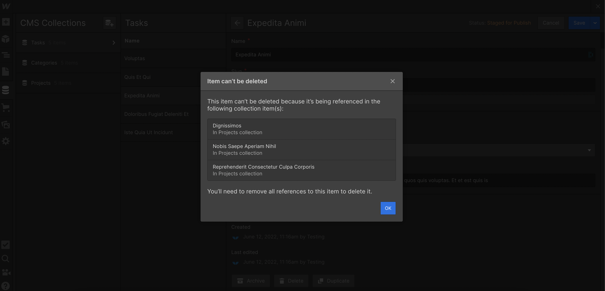

# Common errors - Webflow

#### `ValidationError: 'fields.name' must be of string type`

Certain apps (eg. Webflow) require a value in the "name" field to create records. This error says that the value in one of your record's name fields is missing or invalid.

<mark style="color:green;">Suggested Action:</mark>

* Click into the details of the issue to see which record's name field value is invalid
* If all the fields in this section are blank, it's likely you have an empty record
* Delete that record and retry sync

#### `ValidationError: 'fields.slug' must be of string type`

Certain apps (eg. Webflow) have a required "slug" field. If you map the slug field, you will need to ensure you have valid values in that field. Slugs cannot be empty, have spaces, or contain certain such as periods.

Note - you are not always required to map the slug field. For example, with Webflow, if you do not map the slug field, Webflow will auto-generate slugs for you.

<mark style="color:green;">Suggested Action:</mark>

* Click into the details of the issue to see which record's slug field value is invalid
* Fix that record's slug field to ensure it's valid and not empty
* Alternatively, unmap the slug field in Whalesync

#### `Field 'slug': Unique value is already in database`

Your app (eg. Webflow) is trying to create a record with a certain slug, but can't because a record already exists with the same slug. This may occur if you've previously created a record, then deleted it from Webflow, but not re-published your Webflow site. Webflow doesn't "fully delete" records until the site has been republished which can cause this issue.

If the above is not the case, it could be an indicator that you have more than one record with the same slug in your source app. &#x20;

<mark style="color:green;">Suggested Action:</mark>

* If you're syncing with Webflow, republish your Webflow site and then retry sync
* If you're syncing Airtable, we suggest using an Airtable formula to create slugs: [https://docs.whalesync.com/resources/faq](https://docs.whalesync.com/resources/faq)
* Alternatively, you can unmap the slug field:
  * 1\) edit your Whalesync base
  * 2\) unmap the slug field
  * 3\) turn sync back on
  * 4\) hit "retry sync" from the issues page

#### `InconsistentPublicationsError`

Webflow doesn't like when sites are not published to all possible domains. Specifically, Webflow won't accept API updates if this is the case.

<mark style="color:green;">Suggested Action:</mark>

* Publish your Webflow site to all possible domains and retry sync

.png>)

#### `Conflict: This item is still being used by:`

Whalesync is attempting to sync a delete from your source app to Webflow, but is unable to because that record is still being referenced by another. Here's what this would look like in the Webflow UI:

<mark style="color:green;">Suggested Action:</mark>

* First delete any references to this record in your source app (eg. Airtable)
* Then delete the record

#### `Field ‘_____’: Field not described in schema`

Webflow is saying that it cannot find the field in question. This often occurs if you've made changes to your Webflow CMS, but have not since republished your site. Webflow doesn't officially "save" CMS changes until the site has been republished.

<mark style="color:green;">Suggested Action:</mark>

* Republish your Webflow site then retry sync

#### `NotFound: CMS Items not found:`

Webflow is trying to update a record in the CMS, but cannot find it. This often occurs if you've deleted data in Webflow, but not republished your site. Webflow doesn't fully "save" deletes until the site has been republished.

<mark style="color:green;">Suggested Action:</mark>

* Republish your Webflow site and then retry sync

**`CollectionSchemaChangedError: The collection structure changed since the last publish`**

Webflow requires you to republish your site any time you edit your cms (eg. add new fields) in order to "save" those changes. Without a republish, they block any new updates that come thru the API.

<mark style="color:green;">Suggested Action:</mark>

* Republish your Webflow site
* Hit "retry sync" from your Whalesync [Issues page](https://app.whalesync.com/issues)

**`Webflow is trying to update a record that is no longer in the CMS`**

This issue occurs if you've set up a one-way sync from Airtable into Webflow and then deleted a record in Webflow. Even though it is a 1-way sync, Whalesync will not replace the record that was deleted. Instead, that record will essentially be "dead" to Whalesync.

Unlike most automation tools, Whalesync keeps every individual record in sync all the time. When a record gets deleted, we don't replace it to ensure there are never any duplicates.

<mark style="color:green;">Suggested Action:</mark>

* If it's just a handful of records with this issue, duplicate the records in Airtable to create new versions in Webflow and then delete the originals
* If it's a larger number of records with this issue, we suggest starting from scratch. Delete all records from Webflow, republish your site, delete your Whalesync base and create a new Whalesync base to sync again.
