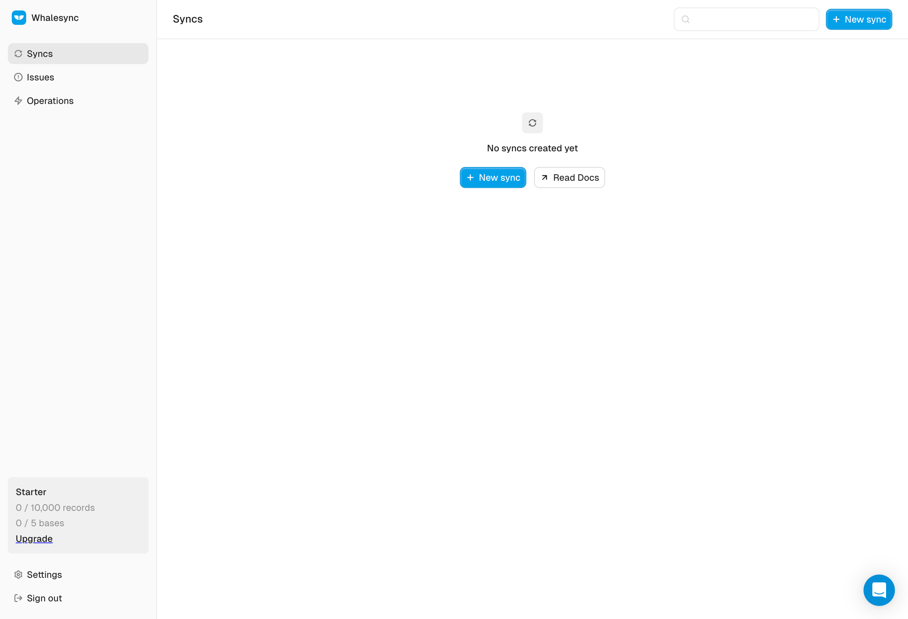
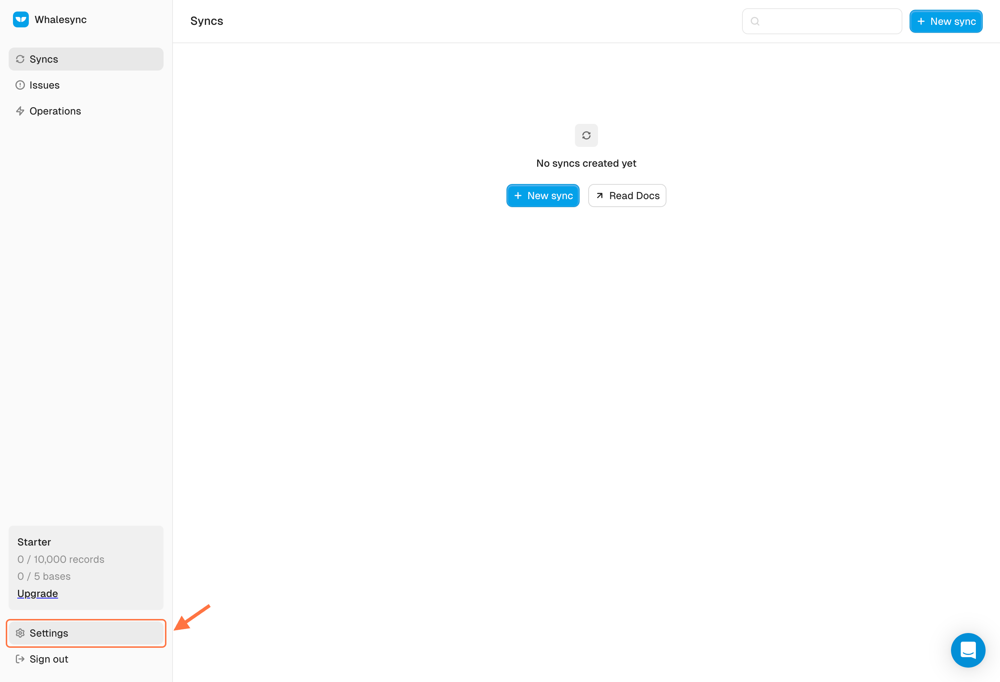
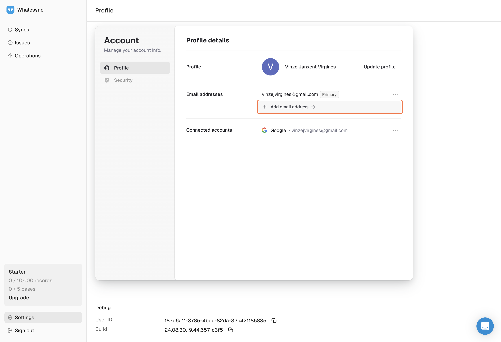
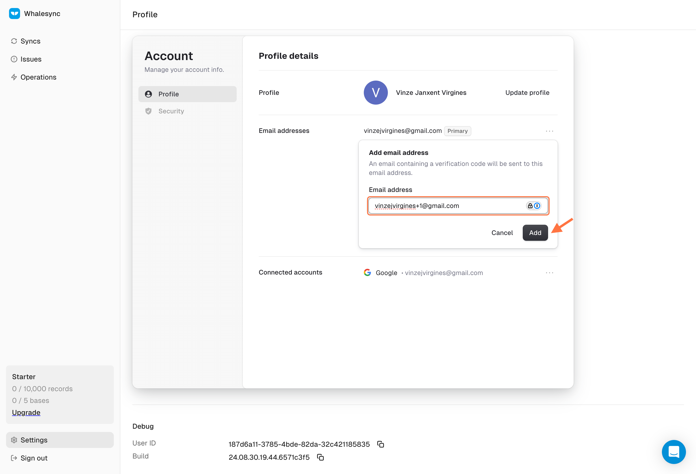
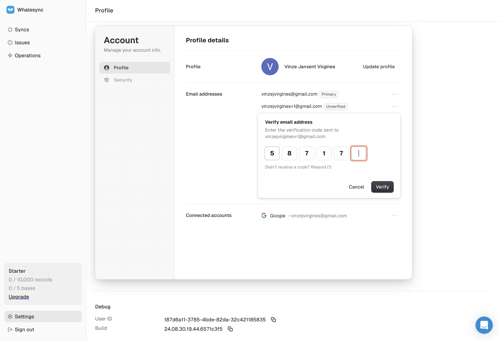
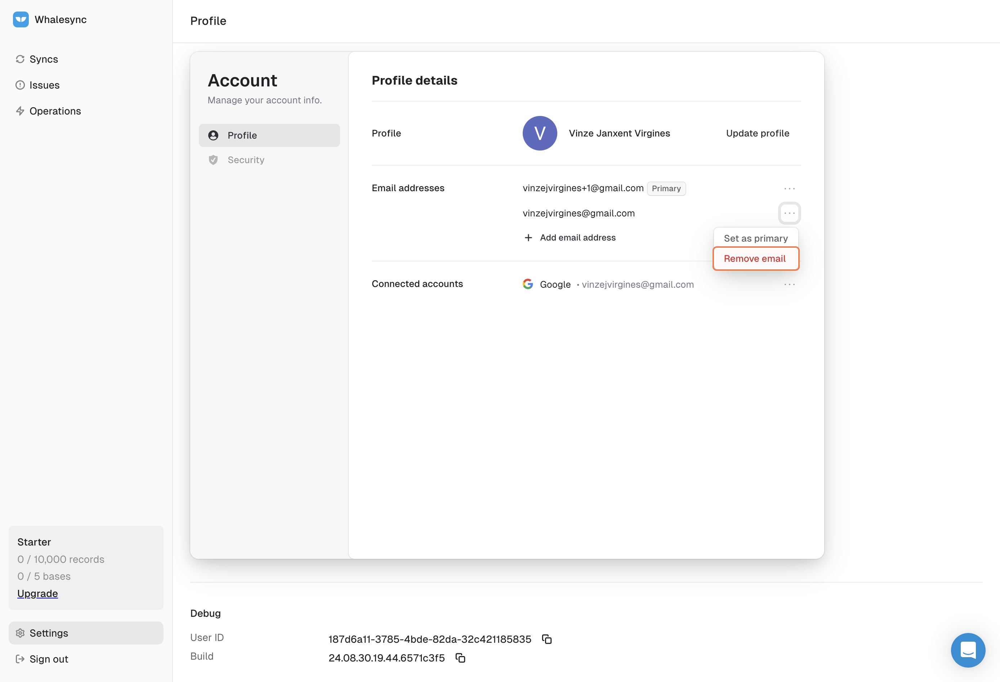

# How to change your email

## How to Change your Email Address

#### 1. Go to your Whalesync dashboard

<figure><figcaption></figcaption></figure>

#### 2. Go to 'Settings'

<figure><figcaption></figcaption></figure>

#### 3. Hit 'Add new email address'

<figure><figcaption></figcaption></figure>

#### 4. Enter your new email address and click on Add

<figure><figcaption></figcaption></figure>

#### 5. Enter the verification code that was sent on your email

<figure><figcaption></figcaption></figure>

#### 6. Set email as primary email

<figure><figcaption></figcaption></figure>

#### 7. \[Optional] Remove other email addresses linked to your Whalesync account

<figure><figcaption></figcaption></figure>

