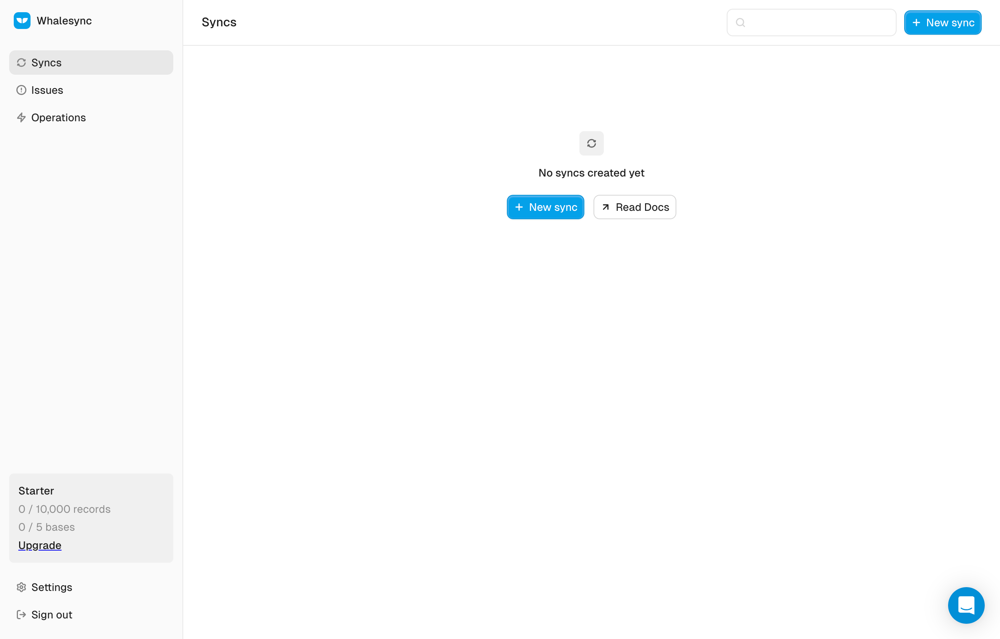
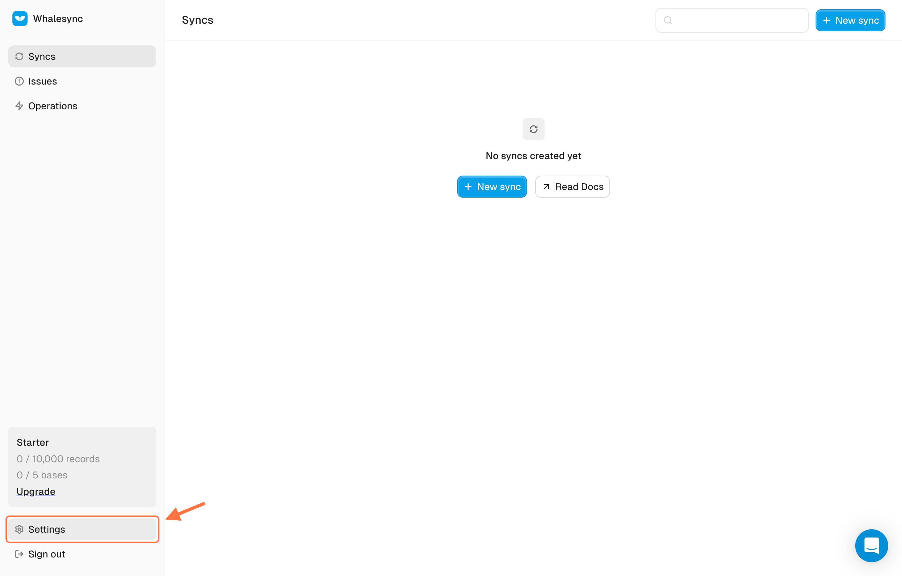
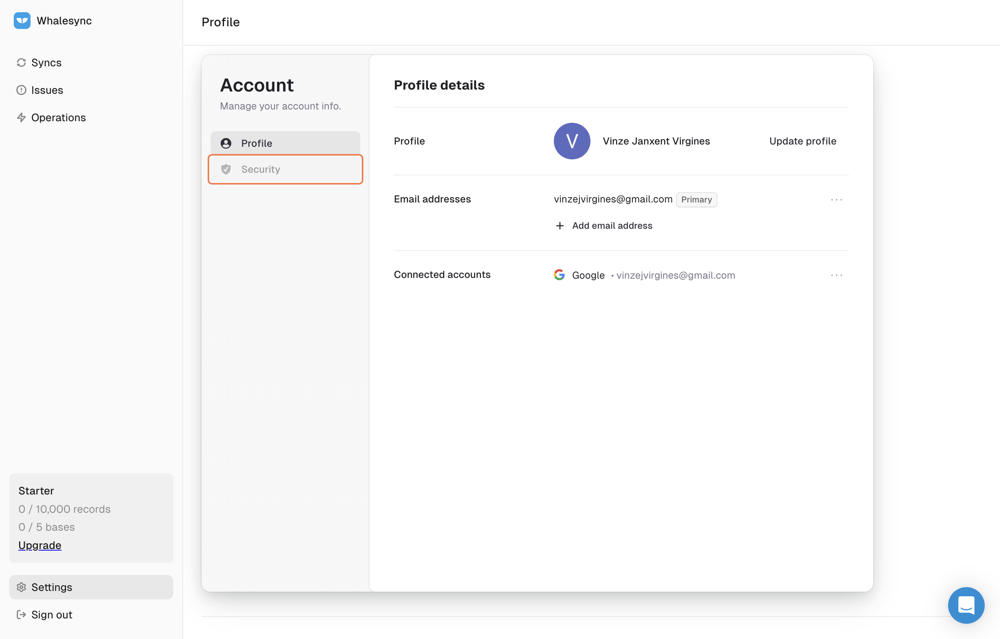
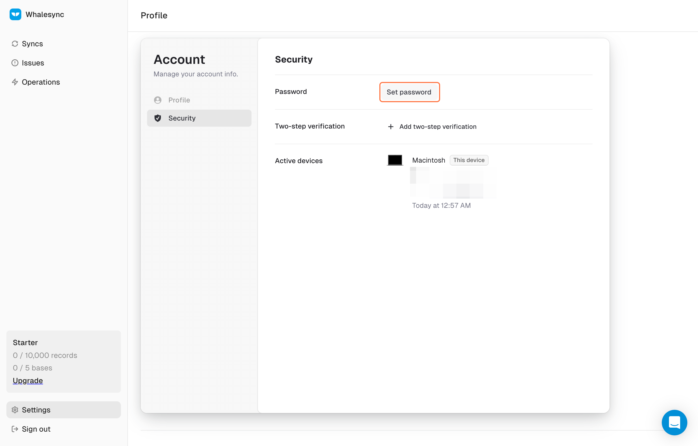
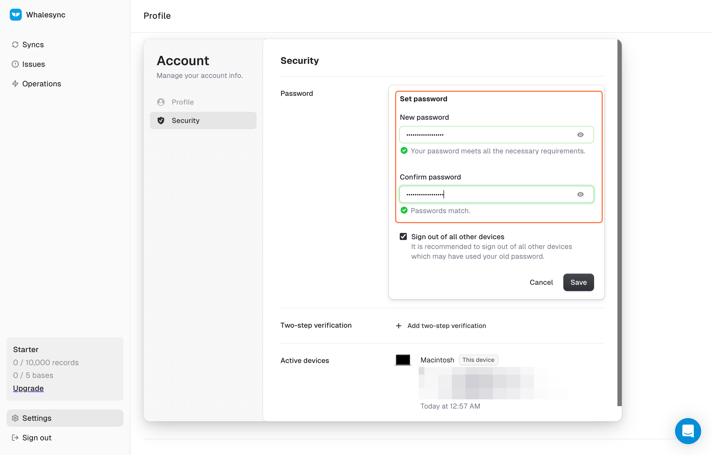
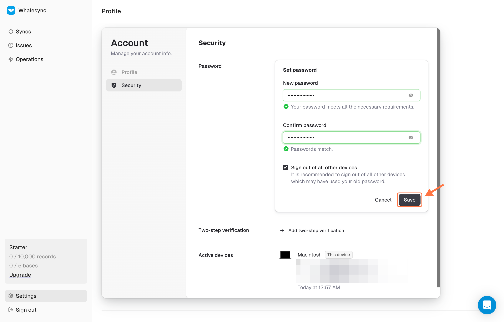

# How to change your sign-in

## How to Change from Google Sign-In to Email/Password Sign-in

#### 1. Sign in to your account and go to app.whalesync.com/dashboard

<figure><figcaption></figcaption></figure>

#### 2. Go to Settings

<figure><figcaption></figcaption></figure>

#### 3. Go to 'Security'

<figure><figcaption></figcaption></figure>

#### 4. Set a password!

<figure><figcaption></figcaption></figure>

#### 6. Enter and confirm your password

<figure><figcaption></figcaption></figure>

#### 7. Hit 'Save' and you're done! 🎉

<figure><figcaption></figcaption></figure>

