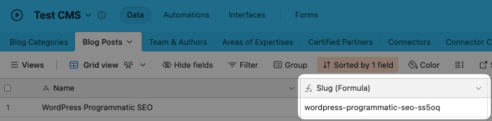

# How to create a slug field in Airtable

Whalesync lets you sync Airtable with CMS apps like Webflow. These apps often require a unique "slug" field to ensure the pages you're creating are unique.

If you need to create a slug field in Airtable there are two options:

### 1) Manual (Single Line Text field)

If you'd like to type in slugs manually, you can use a single line text field.

<figure><figcaption><p>Example Slug field with single line text</p></figcaption></figure>

### 2) Automatic (Formula field)

If you'd like to have your slugs created automatically (recommended!), you can use a formula field.

<figure><figcaption><p>Example slug field with formula</p></figcaption></figure>

We recommend the following formula in Airtable to ensure slugs have the correct format:

```
LOWER(REGEX_REPLACE(REGEX_REPLACE(REGEX_REPLACE(TRIM({Name}), "[^a-zA-Z0-9- ]", ""), " ", "-"), "-+", "-") & "-" & RIGHT(RECORD_ID(), 5))
```

In Notion:

```
replaceAll(prop("Article Title"), "[^a-zA-Z0-9- ]|,| ", "-")
```
