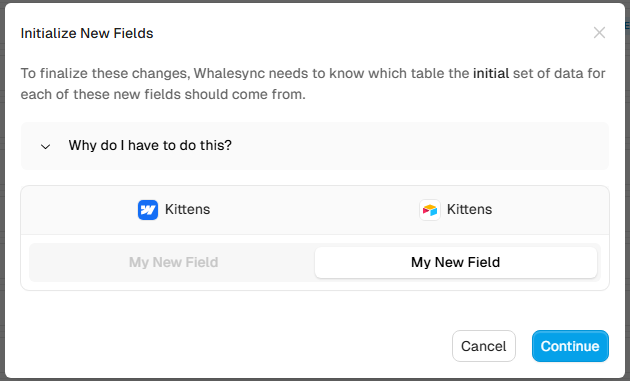

# Sync behavior questions

### If I add a field mapping to an existing synced table, what happens?

When you add a field mapping to an existing synced table, there may be data in that field in the records on both sides of the sync. Whalesync will ask you which side should be considered the initial set of data for this field:

<figure><figcaption>
Modal shown when adding a new field mapping
</figcaption></figure>

Whichever side you pick will be considered as the initial source of truth. The data from that side will overwrite the data in that field on the other side when syncing is turned back on. In the above screenshot, the data in "My New Field" in Airtable will overwrite any data in "My New Field" in the records in Webflow.

### If I remove a field mapping from an existing synced table, then add it back, what happens?

For an existing synced table, let's say you:

* Remove a field mapping
* Save the sync configuration
* Add the field mapping back

Whalesync will consider the field mapping to be brand new and the previous history of the mapping will be lost. In this case, when adding the field mapping back, Whalesync will show the field initialization modal again (see above: [#if-i-add-a-field-mapping-to-an-existing-synced-table-what-happens](sync-behavior-questions.md#if-i-add-a-field-mapping-to-an-existing-synced-table-what-happens "mention")).

When sync is activated, every record in the destination table will be updated again. In the above example, if "My New Field" on the Airtable side is picked, every record in that table in Webflow will get updated with data from "My New Field" from Airtable.
