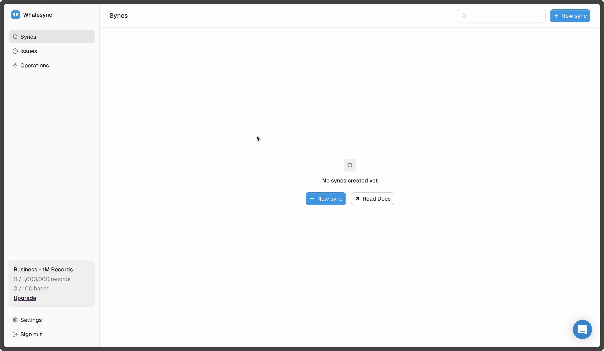
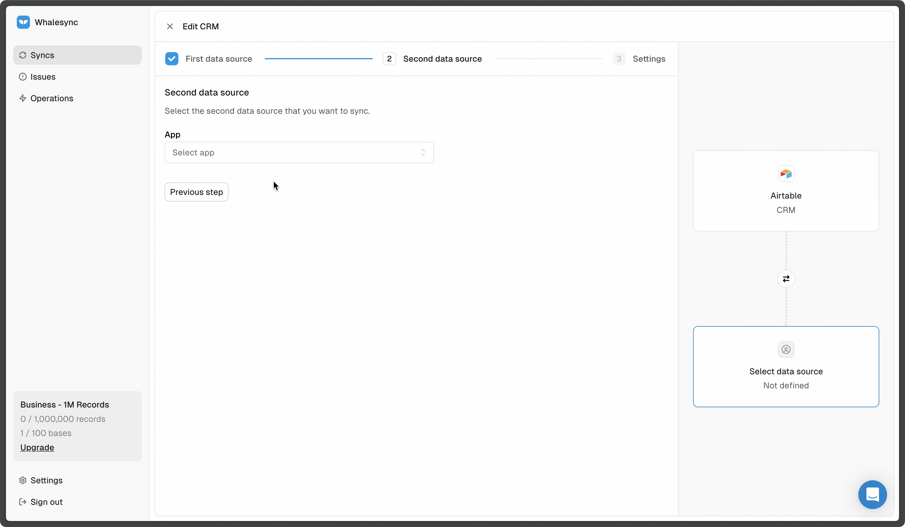

# Quick start

Seeing data sync instantly across your tools is exhilarating. With Whalesync, you can connect apps and start two-way syncing in under five minutes. Here's how:

## Step 1: Create a new sync

From the dashboard, click "New sync" to kick off the setup flow.

<figure><figcaption></figcaption></figure>

## Step 2: Connect your apps

Choose the apps you want to sync and click "Authorize". For certain apps, you'll need to copy and paste an API key, but for most you can sign-in with OAuth.

<figure><figcaption></figcaption></figure>


If you're unsure where to find your API Keys, please visit the specific connector documentation.


## Step 3: Map tables

Choose the tables you want to map together for syncing.

<figure><figcaption></figcaption></figure>


If your table names match exactly, they will show up as suggested.


## Step 4: Map fields

After mapping a table, you can map the specific fields you want to sync and choose the sync direction for each one.

<figure><figcaption></figcaption></figure>


Field names do not have to match, but field _types_ do need to be compatible.


## Step 5: Activate sync

<figure><figcaption></figcaption></figure>

:tada:Woo hoo! That's it. Activate sync and within seconds you should see data begin syncing.


After turning sync on, you can check the the [operations page](../features/operations.md) to see sync updates Whalesync makes and the [issues page](../features/issues.md) to see any sync errors from your connected apps.

